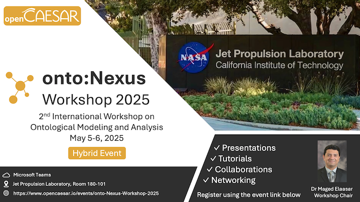

## About onto:Nexus Workshop

The <b>onto:Nexus Workshop</b>, or the International Workshop on Ontological Modeling and Analysis, is a forum for developers, researchers, and practioners to discuss topics related to the application of formal methods (adding rigor), DevOps methods (adding agilility), and AI methods (adding intelligence) to the practice of ontological modeling and analysis. It also intends to foster collaborations within this community.

## Workshop Chair

* [Maged Elaasar](mailto:elaasar@jpl.nasa.gov), JPL

## This Edition

The <b>onto:Nexus Workshop 2025</b> is the 2nd edition of the International Workshop on Ontological Modeling and Analysis. The theme of this edition is "Realizing the RAISE Vision", where we will hear from members of the community about their efforts adding rigor, agility, and intelligence to their systems engineering practices. Moreover, we will have tutorials featuring approaches that exemply the RAISE vision, as well as reports on R&D project led by students of the [RAISE](https://www.opencaesar.io/raise) lab.

The workshop will be a <b>free two-days hybrid event</b> that will take place at the Jet Propulsion Laboratory ([JPL](https://www.jpl.nasa.gov/)) in Pasadena, CA, on May 5-6, 2025, and online in a Microsoft Teams meeting.

## Online Attendance

Register to the [LinkedIn event](https://www.linkedin.com/events/onto-nexusworkshop2025-inperson7247053965337473024?lipi=urn%3Ali%3Apage%3Ad_flagship3_feed%3B8o3OgtDYQPWTIHjJUlHQAQ%3D%3D). Only those who register will be invited to the Microsoft Teams meeting. The deadline for this is May 2, 2025.

## In-Person Attendance

Send an email to the chair of the workshop and wait for a confirmation. The sooner you reserve your spot the better. There will be a logistical on-boarding process to go through to gain access to the venue. The deadline for this is April 15, 2025 if you are a US person, and March 15, 2025 if you are a foreign national.

Drinks and light refreshments will be provided on both days. Lunch will be the responsibility of attendees and can be purchased from the JPL cafeteria.

In person attendees will be taken on a 1h tour of the JPL campus on both days right after lunch. Different sights will be visited on the two days.

## Call for Presentations

This edition's call for presentation is open to members of the community to report on practice or R&D activities related to ontological modeling and analysis. Presentations can be about any relevant work to the RAISE vision. Please send your proposal abstract by email to the chair of the workshop. We will follow up with you after that.

A virtual tour of the JPL campus will be provided for online attendees.

## Call for Tutorials

This year will feature tutorials on tools, technologies, and case studies supporting the RAISE vision. Please send your tutorial abstract by email to the chair of the workshop. We will follow up with you after that.

## DAY 1 Agenda (Monday 5, 2025)

<table>
  <tr>
    <th width="150px">Time (PST)</th>
    <th>Topic</th>
    <th width="200px">Presenter</th>
  </tr>
  <tr>
    <td style="color: blue;" colspan="3">Introduction</td>
  </tr>
  <tr>
    <td>7:30 - 8:30</td>
    <td colspan="2">JPL Visitor Onboarding</td>
  </tr>
  <tr>
    <td>8:30 - 8:35</td>
    <td>Introduction to Day 1</td>
    <td>Maged Elaasar (JPL)</td>
  </tr>
  <tr>
    <td>8:35 - 9:00</td>
    <td>Model-Based Systems Engineering: The State of Practice</td>
    <td>Multiple Presenters</td>
  </tr>
  <tr>
    <td style="color: blue;" colspan="3">Ontological MBSE Applications</td>
  </tr>
  <tr>
    <td>9:00 - 9:30</td>
    <td></td>
    <td></td>
  </tr>
  <tr>
    <td>9:30 - 9:50</td>
    <td></td>
    <td></td>
  </tr>
  <tr>
    <td>9:50 - 10:05</td>
    <td colspan="2">Coffee Break (15min)</td>
  </tr>
  <tr>
    <td style="color: blue;" colspan="3">Ontological MBSE Methods and Tools</td>
  </tr>
  <tr>
    <td>10:05 - 10:30</td>
    <td></td>
    <td></td>
  </tr>
  <tr>
    <td>10:30 - 11:00</td>
    <td></td>
    <td></td>
  </tr>
  <tr>
    <td>11:00 - 11:30</td>
    <td></td>
    <td></td>
  </tr>
  <tr>
    <td style="color: blue;" colspan="3">Lunch and Tour</td>
  </tr>
  <tr>
    <td>11:30 - 12:15</td>
    <td colspan="2">Lunch @ 167 Cafeteria (45min)</td>
  </tr>
  <tr>
    <td>12:15 - 1:15</td>
    <td colspan="2">Tour of JPL Campus (1h)</td>
  </tr>
  <tr>
    <td style="color: blue;" colspan="3">Applications of Ontological Modeling Language</td>
  </tr>
  <tr>
    <td>1:15 - 1:45</td>
    <td></td>
    <td></td>
  </tr>
  <tr>
    <td>1:45 - 2:15</td>
    <td></td>
    <td></td>
  </tr>
  <tr>
    <td>2:15 - 2:45</td>
    <td></td>
    <td></td>
  </tr>
  <tr>
    <td>2:45 - 3:00</td>
    <td colspan="2">Coffee Break (15min)</td>
  </tr>
  <tr>
    <td style="color: blue;" colspan="3">SysML v2 Ontology</td>
  </tr>
  <tr>
    <td>3:00 - 3:30</td>
    <td></td>
    <td></td>
  </tr>
  <tr>
    <td>3:30 - 4:00</td>
    <td></td>
    <td></td>
  </tr>
  <tr>
    <td>4:00 - 4:30</td>
    <td></td>
    <td></td>
  </tr>
  <tr>
    <td style="color: blue;" colspan="3">Conclusion</td>
  </tr>
  <tr>
    <td>4:30 - 4:40</td>
    <td colspan="2">Conclusion</td>
  </tr>
</table>

## DAY 2 Agenda (Monday 6, 2025)

<table>
  <tr>
    <th width="150px">Time (PST)</th>
    <th>Topic</th>
    <th width="200px">Presenter</th>
  </tr>
  <tr>
    <td style="color: blue;" colspan="3">Introduction</td>
  </tr>
  <tr>
    <td>7:30 - 8:30</td>
    <td colspan="2">JPL Visitor Onboarding</td>
  </tr>
  <tr>
    <td>8:30 - 8:45</td>
    <td>Introduction to Day 2</td>
    <td>Maged Elaasar (JPL)</td>
  </tr>
  <tr>
    <td>8:45 - 9:00</td>
    <td></td>
    <td></td>
  </tr>
  <tr>
    <td style="color: blue;" colspan="3">R&D Projects</td>
  </tr>
  <tr>
    <td>9:00 - 9:15</td>
    <td></td>
    <td></td>
  </tr>
  <tr>
    <td>9:15 - 9:30</td>
    <td></td>
    <td></td>
  </tr>
  <tr>
    <td>9:30 - 9:45</td>
    <td></td>
    <td></td>
  </tr>
  <tr>
    <td>9:45 - 10:00</td>
    <td colspan="2">Coffee Break (15min)</td>
  </tr>
  <tr>
    <td>10:00 - 10:15</td>
    <td></td>
    <td></td>
  </tr>
  <tr>
    <td>10:00 - 10:30</td>
    <td></td>
    <td></td>
  </tr>
  <tr>
    <td>10:30 - 10:45</td>
    <td></td>
    <td></td>
  </tr>
  <tr>
    <td>10:45 - 11:00</td>
    <td></td>
    <td></td>
  </tr>
  <tr>
    <td>11:00 - 11:15</td>
    <td></td>
    <td></td>
  </tr>
  <tr>
    <td style="color: blue;" colspan="3">Lunch and Tour</td>
  </tr>
  <tr>
    <td>11:15 - 12:00</td>
    <td colspan="2">Lunch @ 167 Cafeteria (45min)</td>
  </tr>
  <tr>
    <td>12:00 - 1:00</td>
    <td colspan="2">Tour of JPL Campus (1h)</td>
  </tr>
  <tr>
    <td style="color: blue;" colspan="3">Tutorials</td>
  </tr>
  <tr>
    <td>1:00 - 2:45</td>
    <td></td>
    <td></td>
  </tr>
  <tr>
    <td>2:45 - 3:00</td>
    <td colspan="2">Coffee Break (15min)</td>
  </tr>
  <tr>
    <td>3:00 - 4:45</td>
    <td></td>
    <td></td>
  </tr>
  <tr>
    <td style="color: blue;" colspan="3">Conclusion</td>
  </tr>
  <tr>
    <td>4:45 - 4:50</td>
    <td colspan="2">Conclusion</td>
  </tr>
</table>

## onto:Nexus Forum

If you are not yet a member of the [onto:Nexus Forum](https://www.linkedin.com/groups/14235207/) (LinkedIn group), we invite you to join to be part of the community going forward.
