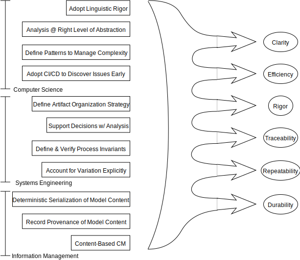

> Elaasar, M., Rouquette, N., Jenkins, S., Gerard, S. “The Case for Integrated Model Centric Engineering,” Proceedings of Model Based Enterprise Summit, Gaithersburg, MD, April, 2019.

# Abstract

Ten plus years after its introduction, the practice of Model-Based Systems Engineering (MBSE) has yet to be widely adopted across the industry. Amongst several reasons, a few stand out: the lack of a formalism with well-defined semantics to create system model, the lack of a methodology to create system model across tools, disciplines, and organizations, the lack of rigor to analyze system model continuously, the lack of comprehensive content-based version control to support provenance, traceability and reproducibility, the lack of best practices in managing configuration and change of system model, and the inability of different kinds of stakeholders to access the system model and provide feedback on it. We call a practice that addresses these challenges Integrated Model Centric Engineering (IMCE). This paper overviews the challenges facing MBSE, discusses desirable characteristics of SE practice, outlines the IMCE principles needed to improve them, and summarizes the impact of adopting IMCE.

# 1.	Introduction: Challenges of MBSE
Models are at the heart of science and engineering. A system model is a simplified version that represents some details of interest about the system while suppressing others. System models facilitate understanding and inform decision making, explaining, and predicting events of such systems.
However, for a system model to enable these analytical features, it must be expressed in a language with sufficiently expressive syntax and precise semantics. The Systems Modeling Language (SysML ‎[1]) standard from the Object Management Group (OMG) is a popular choice among MBSE practitioners. SysML allows modeling systems from different viewpoints including requirements, structure, behavior, and parametrics, while its standard graphical notation facilitates communication with stakeholders about such viewpoints. Until recently, SysML’s informal semantics made it poorly suited for rigorous analysis. Thanks to OMG’s executability roadmap, several SysML viewpoints including: activity diagrams ‎[2], state machine diagrams ‎[3] and composite structure diagrams ‎[4], now have operational semantics useful for simulation-based analysis. OMG’s Object Constraint Language ‎[5] further complements the analysis landscape for well-formedness analysis. However, OMG offers poor support for logical analysis such as consistency (no contradictions) and satisfiability (no incompatible constraints).

In principle, MBSE ought to enable transitioning the systems engineering (SE) practice from document-centric to model-centric on the premise that traditional documents foster misunderstanding, because of tacit assumptions and implicit semantics, whereas descriptive models facilitate precise communication because of standardized semantics. This transition requires complementing MBSE with a methodology. Well-known methodologies include OOSEM ‎[6], State Analysis ‎[7], CESAM ‎[8] and Arcadia ‎[9]. The effectiveness of a methodology requires tool support and extensible modeling languages for tailoring methodology-specific vocabularies, viewpoints, analyses and guidance. Unfortunately, this flexibility is seldom available for many methodologies; some of which conversely lack in methodology-specific logical analysis criteria for enacting useful guidance and encouraging reuse of best practices for supported domains. 

Since systems engineering is inherently a collaborative endeavor, involving multiple teams with distinct responsibilities, it makes sense to organize a system model as a logical aggregate of model fragments assigned to different teams. In practice, significant problems arise due to mismatches between the collaboration flexibility needed for a desired organization and the collaboration capabilities available from modeling tools and applicable standards. This mismatch often results in a substantial level of artificial complexity due to the tool-specific accommodations needed to work around the limitations of the tools. For example, while SysML modeling tools typically support splitting a model into fragments cross-referencing each other, intrinsic limitations in SysML preclude the properties of a SyML element in one fragment to be assigned values in another fragment. Collaboration mismatches are further exacerbated across multiple tools due to poor interoperability/interchange. Progress in standards, such as OMG’s MIWG ‎[10] and OASIS’s OSLC ‎[11], is notoriously lagging behind the level of collaboration support needed in practice, while emerging tool-specific solutions, such as Syndeia ‎[12] and ModelBus ‎[13], underscore the depth of the problem, which is currently tackled at the low-level of discrete model elements, instead of high-levels of methodology-specific patterns.

Furthermore, relating model fragments is insufficient for managing information represented in different ways across multiple kinds of elements and models with partial overlap. For example, intrinsic differences in domain-specific modeling practices (e.g. mechanical, thermal, electrical) in CAD modeling tools preclude a common representation of system-level components. Poor standards and limited capabilities for interchange and interoperability further exacerbate the problem of relating these heterogenous representations. Ontological notions of identity criteria have yet to be embraced in these standards organizations, yet are fundamental to establishing robust correspondence principles. Worse, current MBSE methodologies fail to address the challenge of identity management across the diversity of concerns involved (e.g., risk management, project management, operations and maintenance) to ensure a continuity of identity across viewpoints. Not surprisingly, MBSE practitioners face many challenges in managing the identity criteria used in different models, and sometimes across multiple viewpoints, where legacy practices for naming and identifying engineering elements may turn out to be computationally inadequate for robust identification across models. 

For many reasons, MBSE tools evolved from niche and isolated products to embrace the demand for distributed collaboration, with a corresponding shift away from managing models as individual files, that are uploaded/downloaded from servers, towards proprietary repositories and protocols that operate at the scale of individual model elements. The collaborative landscape in MBSE has become a complex web of proprietary repositories and protocols that defies the trends in software engineering where distributed content-based versioning paradigms, such as GIT, have simplified the collaborative landscape, with vendors embracing the mantra of “X-as-code” for managing concerns (e.g. X as infrastructure, deployment, configuration, operation).

Currently, “X-as-model” does not compute in MBSE; instead, poor configuration management (CM) practices exacerbate trust in MBSE. Without a notion of a GIT-like history of changes made across inter-related model fragments, MBSE practitioners face significant challenges to ensure that products derived from MBSE models are up-to-date with respect to planned changes. Conversely, MBSE practitioners lack GIT-like strong assurances from the collection of inter-related MBSE tools that declaring the current state of MBSE models as a baseline really means a GIT-like commit: an immutable state of affairs that can be retrieved at a later time. Without such strong assurances, it is understandably difficult for stakeholders to trust that MBSE reports really reflect the intended state of the MBSE models, as opposed to whatever the MBSE tools provided when those reports were produced.
In the rest of this paper, we discuss a vision to improve MBSE in practice. Specifically, in section ‎2, we discuss desired characteristics of modern systems engineering practice. We then introduce the Integrated Model Centric Engineering (IMCE) practice in section ‎3 by defining its architecture principles, which help improve these characteristics. In section ‎4, we reflect on the impact of adopting an IMCE practice. We review related works in Section ‎5. In section ‎6, we conclude and outline future works.

# 2.	Characteristics of Modern Systems Engineering Practice
Systems Engineering is not merely any activity that concerns itself with systems. It must, by definition, be an engineering discipline, and therefore manifest those characteristics that distinguish engineering from other fields of endeavor. It must, for example, make effective use of concepts and knowledge from science and mathematics. To be considered modern, it must in addition make effective use of up-to-date techniques and technologies. It must not suffer from any deficiency for which effective remedies have been found in any field.

The following illustrate some desirable characteristics of modern systems engineering practice.

## 2.1	Clarity
By definition, SE is concerned with problems whose scale requires collaboration to solve. Clarity of communication, therefore, is of paramount importance. Systems engineers describe the world as it is, or might be, and propose approaches that can be shown by analysis to achieve some desired goal. Without precise language to describe these states, approaches, and analyses, however, it is impossible to reach consensus among collaborating parties.

## 2.2	Rigor
Engineering achieves rigor in part through its adoption of mathematical principles. Engineering analysis routinely makes use of mathematical abstractions such as differential equations, matrices, statistical distributions, etc. Also, concepts from abstract algebra (e.g., Galois Fields), formal logic, and graph theory, to name a few, have proven extremely valuable in engineering applications. Note that clarity in an engineering language is often achieved by reference to abstractions with definite properties. A capacitor, for example, demonstrates a relationship between voltage and current, specified by a first-order linear differential equation. The name is intimately linked to an abstraction.

## 2.3	Traceability
An SE process entails a large number of decisions, choices, and constraints that represent a creative exercise of design authority. In traditional SE doctrine, the Work Breakdown Structure documents the systematic delegation of this authority along discipline and/or organizational lines. A modern SE environment must preserve the association between an authority and its decisions, otherwise the system architecture becomes a disorganized collection of assertions with no way to determine who asserted what. Moreover, it must be possible, given any assertion in a model, to determine the authority context in which it was made, the rationale for that particular decision, and the relevance of other models that contributed to this assertion. In information management, this information is called provenance.

## 2.4	Repeatability
The analyses that support complex decision-making often require highly-specialized software and large inputs representing information about the system, its environments, customer requirements, operational strategies, risks, etc. As a consequence, these analyses are often expensive to specify, expensive to execute, and disturbingly easy to get wrong. It is important to formalize the complete specification of analyses, including their dependencies, so that once an analysis has been executed once, it can be executed again with minimum overhead and cost. This is important for maintaining confidence in analyses over long system development and operations periods, but also to ensure that trade studies carefully restrict variation to only those factors under study. It is also desirable to isolate the specification of an analysis from its computation.

## 2.5	Durability
Durability is closely-related to repeatability. If any operation is to be repeatable, then any information it requires must be available. The way to ensure this availability is to ensure that any information produced or needed by the SE process is stored once in an accessible location (assuming proper access controls) and never changed or deleted. Such information is said to be immutable. Of course, the iterative nature of SE implies that decisions and designs evolve over time, but this change is better managed by assigning a permanent identifier to every version of any pertinent information and keeping every version permanently.

## 2.6	Efficiency
It is rarely the case that all useful SE contributions for an endeavor have been achieved before resource limits are met. For that reason, efficiency is a key virtue. There are multiple avenues for pursuing efficiency, but one of the most important is automation. Computation has always been an important part of SE, but the recent emergence of powerful systems for logical reasoning, machine learning, data mining, etc., have expanded the opportunities to exploit computation to augment, and in some cases, replace human processes. As with storage, the cost of computation has dropped to the degree that endeavors with only modest budgets can deploy computing resources that would have dwarfed the largest supercomputers a few years ago. Of course, careful attention to repeatability and durability enhances the prospects of efficiency through automation.

# 3.	Architectural Principles for Integrated Model-Centric Engineering
We call a practice that strives to improve the characteristics outlined above an Integrated Model Centric Engineering (IMCE) practice. The following sections describe a set of architectural principles that can guide implementation of an IMCE practice; they are chosen in the context of the desired characteristics described above. We claim adherence to these principles enhances the prospects of improving those characteristics, and we support the claims with rationale as space permits. 

## 3.1	Adopt Linguistic Rigor
Because natural language understanding remains an open challenge, the only pragmatic alternative that promotes clarity of communication is formal language. The breadth of SE, however, precludes an all-encompassing controlled vocabulary; therefore, it is necessary to align controlled vocabularies with limited scopes of architecture viewpoints framing specific concerns of interest to homogeneous cohorts of stakeholders ‎[14]. That is, the controlled vocabulary of a viewpoint should be sufficiently small to facilitate learning for proficient communication and sufficiently expressive to convey those concerns precisely.

## 3.2	Support Decisions with Analysis
Systems Engineering rigor and traceability require identifying stakeholders and concerns, specifying why the concerns matter (rationale) and what it means to address them adequately (conformance). A system model should not merely describe a design, but should also explain why a particular design is preferred. This explanation should involve computable figures of merit and constraints that link design decisions to outcomes and values meaningful in the stakeholder domain.

## 3.3	Analyze at the Right Level of Abstraction
Systems Engineering employs decomposition to transform a problem in one domain (e.g., planetary science) into a set of related problems, typically along engineering discipline (e.g., electrical, mechanical, attitude control etc.) lines. Separation of concerns suggests that we analyze each domain separately and each in its own terms: the science domain is concerned with data sets, coverage, resolution, etc., while the electrical domain is concerned with power allocations, battery state of charge, fault isolation, etc. Maintaining this separation is important for repeatability. Of course, traceability requires that we make a principled connection between domains in the form of analysis that shows, for example, that a coverage requirement mandates a minimum battery capacity, or that failure of a solar panel will reduce downlink data volume.

## 3.4	Define Patterns to Manage Complexity
Adopting linguistic rigor often implies making fine-grained distinctions; complex systems are described by large numbers of simple facts. It is also true, however, that more coarse-grained patterns recur in these descriptions. Modeling component interconnections, for example, makes use of multiple concepts (e.g., component, interface, junction) and multiple relationships (e.g., component presents interface, junction joins interface), but a complete description of a pairwise connection always involves two components, one interface presented by each, and one junction joining the interfaces. Patterns provide a bridge between the SE domain and the knowledge representation domain and support rigor, traceability, and efficiency.

## 3.5	Adopt CI/CD to Discover Issues Early
Repeatability and efficiency argue for automation of analysis. Continuous Integration (CI) and Continuous Delivery (CD) are modes of computing that map and order computing task dependencies to execute tasks as soon as possible, thereby achieving two useful goals: (1) providing early feedback on the analytical consequences of engineering decisions, and (2) regularly exercising analysis automation to ensure it’s ready when needed. Both goals provide systems engineering teams the capability for summarizing the impact of complex collaborative engineering activities and determining whether the predicted characteristics of the resulting design remain within acceptable margins for key stakeholder concern criteria. 

## 3.6	Use Content-Based CM
Repeatability, durability, and efficiency argue for fine-grained configuration management of original data and intermediate results. Beyond mere management of versions, however, the ability to easily determine whether any two versions differ in the most minute detail is essential for strong guarantees of repeatability and traceability, as is the ability to quickly determine if a particular snapshot of content exists anywhere in the CM repository. These features are provided by configuration control systems that use hashes of content as version identifiers. Git is overwhelming the most widely-used and trusted such system today.

## 3.7	Use Deterministic Serialization of Model Content
Content-based CM systems can distinguish content instances based on syntactic differences, but the desired capability is to distinguish semantic differences. This capability can be achieved if each semantically-distinct model has one and only one syntactic serialization. Guaranteeing that is not difficult in practice but it requires conscious intent and care.

## 3.8	Record Provenance of Model Content
Systems Engineering is inherently collaborative, incremental, and iterative. That notwithstanding, there is a logical precedence to the process steps in that each step requires input data and processing capabilities (e.g., software) that transforms model content in some defined state into another defined state. Traceability and repeatability mandate recording the specific instances of all inputs and processing capabilities used to create each instance of every output. Recording provenance at every step creates a “chain of custody” for all information back to its origin. Combined with content-based CM, this capability elevates the guarantees of syntactic repeatability about versioning models in CM to guarantees of semantic traceability about all changes actually made between different versions of models in CM.

## 3.9	Define and Verify Process Invariants
A rigorous, traceable, and repeatable process is specified by unambiguous specifications of preconditions and postconditions. Every computation depends on predicates that must be true if the result is to be trustworthy. Explicit verification of these conditions at each step, integrated into the CI/CD system, helps to ensure that violations of asserted conditions are detected reliably and as early as possible, thereby ensuring that contaminate or otherwise untrustworthy artifacts are not produced. In addition, the thought required to formulate such conditions unambiguously forces clear thought about the definitions of processing steps and leads to deeper understanding of the engineering process.

## 3.10	Define Artifact Organization Strategy
A traceable, repeatable, and durable computational environment is going to produce large numbers of artifacts to be stored and indexed for later access. It is important to devote thought to the organizational scheme for these artifacts, giving due consideration to affinities regarding, among others, the following:

-	Concerns: artifacts addressing related stakeholder concerns should be near each other in the artifact organization scheme and retrievable by concern.
-	Provenance: Similarly, artifacts with related provenance should be similarly related in the organizational scheme. It particular, it should be convenient to locate and retrieve artifact by provenance attributes.
-	Access Control: The nature of acquirer/supplier relationships mandates that cooperating parties control which of their partners can access the information they produce. Organizational schemes that account for this fact systematically simplify access controls and reduce the risk of unintended withholding or disclosure of information.

## 3.11	Account for Variation Explicitly
The collaborative and complex nature of systems engineering typically requires two canonical forms of design variation. One is classically called a trade study, in which multiple possibly-incompatible design options are considered and evaluated according to some preference criteria. The other is inherent in the notion of a baseline, a distinguished state of the design which is official in some sense but often expected to change at a designated milestone in the future. The engineering environment must expose the baseline but allow work to proceed toward the next milestone, including all necessary analysis, reporting, etc.

These situations require the engineering environment to maintain distinct variants and associate each with applicable metadata (e.g., trade option description, baseline status designation) in such a way that work in each branch is isolated from every other branch, but branches can be merged when desired. This approach to variation management is common in software development and is again one of the strengths of Git.

# 4.	Impact of Adopting IMCE Practice

*Figure 1: Adopting IMCE architecture principles helps improve the desired charachteristics of MBSE practice*
{: .image-credit}

Meaningful adoption of the principles described above entails much more than mere endorsement of slogans. It requires honest and occasionally brutal examination of current practice and the will to change for the better when warranted.

For example, consider the impact of a commitment to linguistic rigor. Such a commitment would entail agreement within a community to use a consensus lexicon and grammar in both oral and written communications, in standard engineering products, and in interaction with information systems that support engineering analysis. Process guidance and training material may need to be updated. Software may need modifications. Similarly, a commitment to recording provenance would require practitioners to ask, whenever information is stored, to ensure that it is annotated with whatever data will be necessary for some future party to understand its meaning and judge its importance.
These principles may seem burdensome, and indeed they are when considered only as individual responsibilities. The cost to any individual, however, is more than made up by the benefits each individual realizes from his or her peers also meeting those responsibilities. 

Systems engineering is increasingly driven by the need to curate large volumes of information representing a broad range of concerns and expressed in discipline-specific terms. Engineering, however, is by no means the only field being so driven, and powerful solutions to these drivers, applicable to many fields, are emerging from the computer science and information management disciplines, as shown on the left side of Figure 1. The architectural principles reflect this fact. 

The principles also reflect the fact that computation and data storage costs have plummeted in recent years, to the point where it is economically feasible to preserve many versions of large data sets indefinitely, and to harness large numbers of processors for computationally-intensive tasks. This has profound implications for the practice of engineering.

Putting these principles into practice implies, among other things, that every valuable fact in the scope of systems engineering for a given program is expressed in standards-based language using established formalisms, stored such that it can be accessed using standard query protocols and languages, annotated with complete provenance data, and retained indefinitely. It implies use of scalable computing resources to perform any operation, for which machines are more reliable than humans. Most of all, it implies recognition that the primary product of systems engineering is knowledge in the form of information and a commitment to treating that knowledge at all times as valuable along multiple characteristics as shown on the right side of Figure 1.

# 5.	Related works
Addressing the challenges of MBSE is on the agenda of several organizations in the industry. One such organization is INCOSE, which recently released their vision for using Integrated Data as a Foundation for Systems Engineering ‎[15]. The vision outlines the MBSE challenges, how they should be addressed from a data-centric perspective, and how to transition organizations towards implementing the vision. We see the IMCE vision described in this paper as in-line with the INCOSE vision, sharing a similar strategy for practicing MBSE from integrated and data-centric perspectives. Moreover, we highlight the desired characteristics of such practice and enumerate the architecture principles needed to enable it.

Another relevant organization is the OMG, which has recently issued two requests for proposals (RFPs). The first is for SysML v2 that enables more effective application of MBSE by improving precision, expressiveness, interoperability, consistency and integration of the language concepts relative to SysML v1. The second RFP complements the first by requesting a set of APIs and services for SysML v2 that supports construction, query, viewpoint management, analysis, CM, and transformation of SysML v2 models. We view this effort as synergetic as it facilitates using SysML as a lingua franca by SE tools and improves the chances of success integrating them. We work closely with the OMG to influence submissions to these RFPs.

# 6.	Conclusion and Future Works
This paper highlighted the challenges facing MBSE practitioners today and described the IMCE vision of addressing them. The approach was presented in terms of the desired characteristics of modern systems engineering practice (which are clarity, rigor, traceability, repeatability, durability and efficiency), and the architecture principles that are needed to improve each one of them.

In the future, we plan to define a reference architecture for a software platform that helps systems engineers adopt an IMCE practice. The architecture will propose ways to realize the IMCE principles in order to achieve the desired characteristics. We also plan to implement the architecture using state of the art technologies. Moreover, we plan to develop applications on the platform that focus on various SE disciplines and applications.

# Acknowledgements
This research was sponsored by the Jet Propulsion Laboratory, California Institute of Technology, under a contract with the National Aeronautics and Space Administration (NASA).

# References

1.	OMG, [SysML v1.5.](https://www.omg.org/spec/SysML/1.5/)
2.	OMG, [FUML v1.4](https://www.omg.org/spec/FUML/1.4/)
3.	OMG, [PSSM v1.0 Beta 1](https://www.omg.org/spec/PSSM/1.0/Beta1/)
4.	OMG, [PSCS v1.1](https://www.omg.org/spec/PSCS/1.1/)
5.	OMG, [OCL v2.4](https://www.omg.org/spec/OCL/2.4/)
6.	Friedenthal, S., Moore, A., Steiner, R., “A Practical Guide to SysML: Systems Modeling Language.” Morgan Kaufmann/OMG Press, Elsevier Inc., Burlington, 2015.
7.	Ingham, M., Rasmussen, R., Bennett, M. and Moncada, A., "Engineering Complex Embedded Systems with State Analysis and the Mission Data System." Journal of Aerospace Computing, Information, and Communication, vol. 2, no. 12, pp. 507-536, 2005.
8.	CESAM-Community, [CESAM: Cesames systems architecting method](http://cesam.community/wp-content/uploads/2017/09/CESAM-guide_-_V12092017.pdf). January 2017. 
9.	Voirin, J.-L., “Model-Based System and Architecture Engineering with the Arcadia Method.” ISTE Press - Elsevier, London, 2017.
10.	OMG, [Model Interchange Wiki](http://www.omgwiki.org/model-interchange/doku.php)
11.	OASIS, [Open Services for Lifecycle Collaboration](https://open-services.net/)
12.	Intercax, [Syndeia](http://intercax.com/products/syndeia/)
13.	Fraunhofer, FOKUS, [ModelBus](https://www.modelbus.org/)
14.	ISO/IEC/IEEE 42010, [Systems and Software Engineering – Architecture Description](https://www.iso.org/standard/50508.html), 2011.
15.	INCOSE, [Integrated Data as a Foundation of Systems Engineering](http://www.omgwiki.org/MBSE/lib/exe/fetch.php?media=mbse:rwg_data_as_a_foundation_of_se_draft_5_050218_review_copy.pdf). July 2018.
