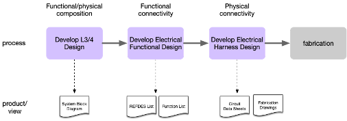
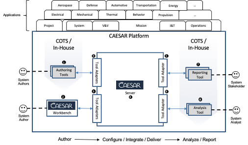
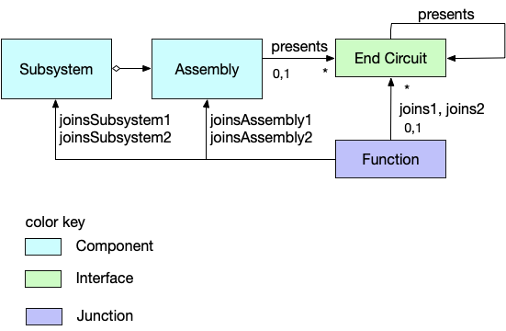
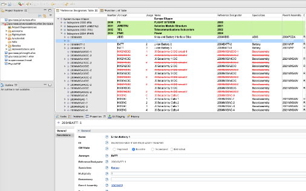
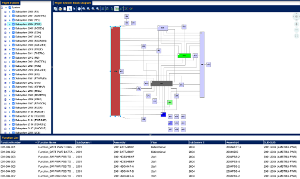
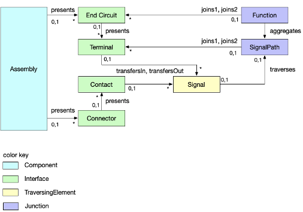

> Wagner, D., Kim, S., Jimemez, A., Elaasar, M., Rouquette, N., Jenkins, S. "CAESAR Model-Based Approach to Harness Design,” Proceedings of IEEE Aerospace Conference, Big Sky, MT, USA, March, 2020.

## Abstract
In this paper we describe a system called the Computer Aided Engineering for Spacecraft System Architectures Tool Suite, or CAESAR for short, a platform for enabling model-based system engineering (MBSE). CAESAR recognizes that engineers are already likely to use models, but they typically keep the models private, only interpreting model information into documents or presentations that become project baseline. MBSE needs to enable more automated sharing of information directly between models to ensure model consistency, improve the rigor of engineering process, and ultimately, reduce the effort needed to get a clear answer to engineering questions. We explain the features of CAESAR, and describe how these features were leveraged in a case study where CAESAR was used to develop a model-based process for spacecraft electrical interface design and harness specification for the Europa Clipper flight project.

## 1. Introduction

The Jet Propulsion Laboratory (JPL) has been evolving its system engineering methods to manage engineering information in descriptive models from documents for about a decade. Numerous demonstration and operational examples of Model-Based System Engineering (MBSE) have been reported. Some of these were institutionally-funded demonstration efforts that would produce potentially useful tools, but tools that could not transition to operational use due to lack of documentation and support. e.g.,[1]–[3]. 

Some of these were project-funded initiatives aimed at improving the system engineering process on a particular project. The Europa Clipper project, in particular, invested in developing architecture models and associated performance analysis tooling [4]–[9]. While these have benefitted that project, none of it has been reused on another project, and it remains unclear how much of this investment can be reused on other projects. 

For the last decade JPL’s Engineering Development Office (EDO) has funded the advancement of model-based system engineering through the Integrated Model-Centric Engineering (IMCE) program. IMCE primarily funded small demonstration projects with the hope that some of them would take root and find a niche in the systems engineering community. By 2016 it was becoming evident that using models to support system engineering had clear benefits but changing the culture of an entire community from the practices they were familiar with was going to take more than just some potentially useful tools.

In order for new tools and methods to replace traditional methods, it would be necessary to establish a sustaining organization and to develop not only new tools but also the associated new methods and associated training and documentation. And it would be necessary to work with the organizational owners of engineering process to develop methods and tools that those organizations could formally integrate into their standard process for doing their work [10]. 

Recognizing that the existence of modeling tools alone was not sufficient to change the practice of system engineering, JPL’s Engineering and Science Directorate established the CAESAR project in 2017 for the purpose of establishing, with the collaboration of the various discipline organizations that own engineering process at JPL, a set of standard engineering methods along with the tools needed to support those methods. System engineering involves many different organizational components, engineering functions, and produces many different products, none of which are supported by any formal models at the outset of this effort. Given that it would not be possible to change all of system engineering in one step, the effort established a five-year roadmap to focus on a few key disciplines starting with electrical harness design. In subsequent years the scope will expand to include more general architectural descriptions of behavior and performance.

In this paper we describe the CAESAR approach to model-based system engineering through a case study in which the CAESAR project developed an improved methodology for the specification and design of spacecraft electrical harnesses for the Europa Clipper project. This case study will walk through the process that was used by the CAESAR team to develop a set of reusable platform capabilities and then leverage them to implement a workflow to produce a given set of engineering products. First, let us introduce the subject discipline and explain why it provided a good subject for this case study.

### Flight System Harness Specification
Spacecraft are robotic systems with thousands of distributed sensors and actuators and other electrical parts that need to be connected electrically. The majority of these are connections between subsystems that the flight system engineers needs to identify, specify, design and fabricate in cooperation with the harness engineering section at JPL. The harness specification process usually begins early in the design as subsystem suppliers propose strawman designs and system engineers begin to propose requirements. Subsystem suppliers negotiate through the system for resources including power, and command and data interfaces. These functional connections are traditionally tracked in some ad-hoc form. Eventually, each functional connection would need to be elaborated into a wiring design that maps particular connectors and pins at the physical interface of each connected assembly, a separate routing design needs to specify the routing around the geometry of the system, and the separate wiring designs need to be bundled into final harness designs that could be delivered for fabrication.

*Figure 1 Harness Design Process Steps*

Although the detailed electrical and mechanical designs have been performed in CAD tools, the specifications for these designs as generally been done through a spreadsheet. Over several project generations the spreadsheet template had grown in complexity to include many design details for each specified connection and it was being adapted in an ad-hoc fashion for each new project. 

In early 2018 the Europa Clipper project was entering its design phase where electrical harness would be specified and designed. Because the implementing organization recognized the need to improve their process, they and the project were willing to partner with the CAESAR project at that time to begin developing a better way to specify electrical harness. The IMCE sponsor was also eager to leverage lessons learned from the development of an earlier electrical design tool whose name was repurposed for the CAESAR project[3]. 

Before describing the development case in detail, let us briefly review the subject flight project.

### Europa Clipper Project
Since the Voyager and Galileo missions sent back the first close-up measurements of Jupiter’s moon Europa scientists have been eager to go back to follow up on hints that Europa may have a large liquid water ocean below its icy crust. The Europa Clipper mission is being developed to send a large solar-powered spacecraft to the Jovian system to perform multiple close observational flybys of Europa to better understand this hidden reservoir of water as a potential habitat for extraterrestrial life.

Model-based system engineering has had a notable role I the development ofthe Europa Clipper mission [4]–[9]. The Europa project is being co-led by JPL and the Johns Hopkins Applied Physics Laboratory (APL). Europa’s electrical harness specification effort is being led out of JPL.
Paper Overview

In this paper we will describe a case study in which a particular engineering function was evaluated and improved using a particular model-based approach. We begin by describing the prior state of practice of the harness specification and design process at JPL. Next, we describe the CAESAR modeling approach and its associated reference architecture for a coordinated set of information services needed to support a model-based process. Following that we describe how this architecture was adapted to the particular needs of the harness specification teams on Europa Clipper, and we will assess the success of this effort. We will review some lessons learned and identify continuing work in this and other disciplines.
Finally, we will summarize the benefits of the architectural approach used in this development.

## 2. CAESAR MBSE Architecture
CAESAR is a software system for streamlining the systems engineering practices of an organization following an MBSE approach. It allows an organization to shift its focus from tools to its systems engineering methodology. In this section, we provide a brief overview of the CAESAR architecture highlighting its goals and functions. We focus only on those aspects that pertain to the case study. We also avoid going into detail about the technical implementation of some features, choosing instead to focus on the architectural goals. Some of the platform capabilities were developed prior to the start of the case study, others were developed as needed in the study, and others remain in development. Details of the implementation will be described in a future publication.

### Goals

The CAESAR architecture aims to allow an organization to define its own systems engineering methodology with six desirable characteristics. The first characteristic is rigor of description. This is achieved by using a precise language that is rooted in mathematics to describe systems with. Without this, it is impossible to unambiguously analyze those descriptions. The second characteristic is clarity of description. This is achieved by using common vocabulary consisting of concepts and their properties and relationships. Without this, it is impossible to reach consensus among collaborating parties. The third characteristic is traceability of information. This refers to the ability to trace from an authority to its design decisions and constraints, and from the latter to their rationales. This is called the provenance of the information. Without this, a system description becomes a disorganized collection of assertions. The fourth characteristic is repeatability.  This refers to the ability to encapsulate the analysis of the system description, including its dependencies, such that it becomes repeatable. This is important to maintain confidence in the analysis over time and use it to assert desirable properties. The fifth characteristic is durability. This refers to the ability to version control the information that describes or analyzes a system in such a way that versions become immutable. Without this, it is impossible to perform audits and repeat analysis. The six characteristic is efficiency. This refers to the ability to automate processes that are otherwise manual and tedious. Without this, such processes become expensive and error prone. 

 
*Figure 2 CAESAR Platform*

### Functions

The CAESAR architecture is split structurally into two tiers (Figure 2). The first tier is a generic and extensible platform for model-based engineering with capabilities that cross-cut many application domains. The platform consists of a number of subsystems, each of which is allocated some functions of the platform. In this section, we describe those functions and point out which subsystem of the platform fulfills it. The second tier is a set of domain-specific applications, like Electrical Systems Engineering, which is the focus of this paper, that are defined on top of the platform using its extension points.

### Information Representation

This platform function refers to the ability to represent the system engineering information in a rigorous and clear way that is consistent with the organization’s methodology and independent of the tools used. The first element of achieving this is by using a descriptive language with a well-defined syntax and semantics. In this case, CAESAR uses the Ontological Modeling Language (OML [11]), which is a pattern-based restricted version of the Description Logic (DL) profile of the Web Ontology Language v2 (OWL2 [12]). In other words, OML brings the descriptive and logical analysis power of the semantic web standard OWL2-DL to the field of systems engineering. While this addresses the rigor characteristic, the clarity characteristic is addressed by defining a set of OML vocabulary that represent the various domains and disciplines in scope of the organization’s methodology. This allows all the systems engineering information to be expressed in terms of this methodology-specific but tool-neutral vocabulary, as opposed to the vocabulary of the tools being used at the time. In our case study, an OML vocabulary for Electrical System Engineering and Harness Design was developed (Figure 3).

### Information Authoring

This function expresses the ability to author systems engineering information by a certain authority and from a certain viewpoint. These viewpoints are defined by a methodology to address certain (discipline, domain, or organizational) concerns. Each viewpoint has a set of vocabulary that describes it and one or more tools that can author views conforming to it. Such tools may already exist (as COTS or in-house) or need to be developed. Moreover, the existing tools may already support the viewpoint natively or may need to be extended to support it better. For example, in the case study, the wiring design viewpoint in the Electrical CAD tool Capital Logic (#1 inFigure 2), is used in a particular way that is dictated by the methodology. In the case where no existing tool supports a viewpoint, a new tool is developed. In the case study, there was no suitable tool to support the electrical requirements authoring viewpoint, so a new tool was developed. This tool was realized as a plugin to the CAESAR Workbench (#2 inFigure 2), which is the platform’s subsystem for realizing new authoring tools. 

### Information Integration

Viewpoints supported by authoring tools typically represent information in a tool-specific schema and/or format. This is not ideal since analysis of the information would need to be performed in a tool-specific way. In addition, integrating information across tools can be challenging. This is why the CAESAR architecture allows defining authoring tool adapters (#3 inFigure 2), which are interfaces that map the information back and forth between the tool-specific schema/format to the tool-neutral vocabulary in OML. These adapters normalize the information such that they can be integrated across tools. They also protect the integration tooling from expensive migrations when new versions of the current tools or new tools are used instead. In the case study, two adapters were developed, one for the electrical requirements in the CAESAR Workbench and one for the electrical design in Capital Logic.

Integration between federated views can be a challenge, especially when the number of such views increase. The ideal way to perform such integration is step by step in an incremental fashion. This is why the CAESAR server (#4 inFigure 2) allows defining a methodology-specific integration flow (the one developed for the case study is shown in Figure 5) consisting of multiple steps. Each step in the flow takes as input information that is the outputs of the previous steps. The root steps in the flow run the tool adapters to transform the views from the tool-specific format to the OML format. Subsequent steps merge the input OML datasets from the previous steps into a new dataset. Each of those steps run a number of analyses on the datasets and the analysis results are published to stakeholders as reports for review or to other tools for further processing.

### Information Analysis

An integration steps run by the CAESAR server involve executing analyses on the OML datasets using a variety of analysis tools (#8 inFigure 2). The first of such analyses is checking logical consistency using a DL reasoner (e.g., Pellet[13]). This analysis detects if there are any logical inconsistencies based on the semantics of the vocabulary (e.g., electrical engineering in the case study) that the dataset is specified with. Another analysis involves running audit rules, which are a set of checks that can be specified in some suitable query language like SPARQL[14]. For example, in the case study, several audit rules are developed to check methodological conventions, such as all subsystem numbers have to be 4 digits that start with 2. In addition to that, many other analysis tools can be used by mapping the information from its tool-neutral OML format to the tool-specific format of those analysis tools. Such mapping is performed by an analysis tool adapter (#6 inFigure 2). The result of running an analysis can then be available for reporting to stakeholders or for consumption by another tool.

### Information Reporting

The result of running an analysis can be reported on using a reporting viewpoint that frames some user concern. Examples of reports include problem reports, or ones that project the results in a certain way (e.g., tabular, diagram, tree, chart, etc.). In the case study, example reports include ones that show the flight system decomposition, and ones that report on technical resources (e.g., power switches). Such reports can be designed using a variety of reporting or analytics platforms (#7 inFigure 2), including notebooks (e.g., Jupyter Notebook[15]), perspectives (e.g., Tom Sawyer Perspectives[16]), and documents (e.g., Open Office). Most of these reporting tools have an API that can be invoked to view a report. But, if they do not, then CAESAR allows for developing such API in a reporting adapter (#5 inFigure 2).

### Information Configuration Management

The artifacts produced by the CAESAR system, either by users during authoring or by machine during analysis or reporting, are version controlled, configuration managed, and annotated with provenance metadata. The version control allows for tracking the evolution of those artifacts over time, which helps when performing audits of certain changes. The provenance information adds more details about how these versions were produced. The configuration management of those artifacts allows for an effective way to manage their variability. Changes get proposed in separate configurations that are analyzed by the same integration flow, and get reviewed and approved by users before being merged into the baseline, which is a protected configuration that represents the official information of the project. CAESAR manages a unified baseline across all repositories used in a project, in addition to the baseline configuration managed by each repository. Other use cases for different configurations include supporting trade studies of proposed designs, or to manage design variants (e.g., test bed configurations).

## 3. TRANSITIONING THE STATE OF PRACTICE

This section will describe how the CAESAR platform was leveraged to improve the electrical engineering process for Europa Clipper. Collaboration between the CAESAR team and the Europa Clipper electrical flight-system engineering team began in early 2018 as the Europa team were beginning to identify electrical functions. At this point, the project had already begun using a spreadsheet to capture assemblies and connecting functions, but had committed to working with the CAESAR team to improve their process. Planning initially focused on the most immediate need for an authoring tool to replace the spreadsheet. But before a tool could be built it was necessary to capture an understanding of what information it needed to capture and express.

### Capturing the Essential Domain Vocabulary

After assessing the spreadsheet that the Europa team were already using the CAESAR team developed an initial metamodel or schema describing the spreadsheet content in the form of an OWL ontology. This process involved many interviews with practitioners and reviews of proposed metamodels until it was agreed that all parties understood the essential structure of the information being captured. The ontology simply defines the things relations the model needs to describe as a pattern of things and relationships (see Figure 3).  For example, an Assembly is defined as a thing that can present electrical signal interfaces that need to be joined. These ontologies were developed as extensions of existing ontologies for more primitive system engineering concepts in order that certain general relations could be reused. For example, an electrical Assembly is defined as a specialization of a Component from the mission ontology. We use namespace notation to indicate that each of these concepts is defined in a distinct namespace: fse:Assembly specializes mission:Component. A mission:Component has relations to work package authorities who either authorize or supply the component. 

*Figure 3 Initial Specification Ontology*

Similarly, fse:Function was defined as a specialization of mission:Junction -- a thing that can join interfaces presented by Assemblies. Note that it was important to define Function as a concept -- not just a simple relation -- because it needs to have its own properties, and simple relations in OWL can’t have properties. Electrical functions are intended to capture abstract signal delivery between assemblies, so interfaces were defined in terms of fse:End Circuits which identify a proxy for a functional producer or consumer of a particular signal. These can also be mapped to internal resources such as switches, multiplexers, or other devices that have functional relationships to particular signals without having to explicitly model those things as Components, and thus preserving the black-box nature of the assemblies (specifically, this is intended to be an architectural model, and thus should not try to assert the existence of internal parts in assemblies that are supplied as integral components).

A fse:Function is meant to express a requirement to conduct a signal between interfaces on multiple assemblies. A fully-specified function joins to specific end circuit interfaces. Additional relations were added to permit a function to be partially expressed as connecting only to an assembly or even just a subsystem in order to support a development process where sometimes a function (as a requirement) may be defined before one of the target assemblies has been fully specified. For example, a need to power a heater may be defined before the power source exists in the architecture. 

The initial ontology also makes a distinction between which side of the function a given assembly is joined (i.e., joins1 versus joins2) in order that functions may express a sense of directionality. This directionality is superficially described as the sense of the signal flow, but it is interpreted to imply the dependency sense of the requirement. For example, a function to power a load is expressing a requirement on the power source end to supply the power.

The ontology intentionally stopped at the level of essential primitive concepts and relations assuming that further type specializations (i.e., kinds of functions) could be modeled in a user-editable libraries. 

Additional vocabulary was developed to reflect the design elaborated in the Capital Logic CAD tool, including concepts for Net (a signal delivery path between end circuit terminals), Wire (a segment of physical conductor between physical connector terminals or splices), and physical Connectors and Contacts. 

### Implementing a new Authoring Tool

It was determined early on that, to reduce the learning curve for the Europa engineers who were already using their spreadsheet, the user interface to the new CAESAR tool should retain the basic tabular presentation of assemblies and functional connections. The CAESAR team implemented an authoring tool in the eclipse-based OML workbench to mimic the spreadsheet’s tabular viewpoints. 

A special importer was developed to ingest the data the Europa team had already gathered in their spreadsheet and this was used over a period of time to allow the Europa team to continue to use their spreadsheet operationally while evaluating incremental versions of the workbench as it was being developed. Once a minimally necessary set of features were stable in the workbench the spreadsheet was retired and the Europa team committed to managing their data in the model. Only about six weeks elapsed between when the workbench was first introduced to the Europa team and when they were prepared to retire their spreadsheet. This rapid conversion was made possible, in part, by the fact that the workbench was being built using a number of effective and stable frameworks including the eclipse modeling framework (EMF), and Git, which had all been previously vetted in an earlier prototyping phase. In particular, EMF made it extremely easy to implement the EFSE ontology in an application metamodel, and build simple tabular user interfaces upon that. 

The workbench design also leveraged a pre-existing Github-Enterprise (GHE) deployment at JPL to provide both configuration management and data distribution services. EMF provided the service to serialize models in an XMI file format. Those files were stored in a Git repository. And, since the Eclipse platform also provides a Git integration, the workbench could provide an integrated change control service with no extra development costs. 

Europa workers were pleasantly surprised at how the very first evaluation versions of the workbench were immediately identifying, and sometimes fixing errors in their data. Some of the most common errors in the initial import were referencing errors where, e.g., an electrical function would reference by name an assembly that did not exist in the assembly list. In such cases the importer could not create an actual reference from the function to an existing assembly but it remained important to preserve the user input as hint to their intent. Thus, the importer created an annotation containing the erroneous value that would be presented in the user interface as a highlighted field indicating to the user that a fix was needed.
 

*Figure 4 Composition view in CAESAR workbench*

The user interface was constructed so that such referential errors were impossible to make while editing in the workbench: a user could only select from the list of defined assemblies when naming an assembly joined by a function. Because of this all such referential errors were eliminated from the model shortly after the workbench was adopted.

Another useful feature of EMF is its support for implementing validation rules. Using this feature, the CAESAR team were able to implement many consistency checks that could either be run dynamically as the model changed, or on demand. These rules were used in cases where it was not possible to otherwise prevent the introduction of an error, or where the tool intentionally granted the user the benefit of the doubt in cases where user input looked suspicious but could not be proven wrong. An example might be a case where a function refers to an assembly that had been marked as deprecated, reflecting a formal intent to remove it from the design. This implied that any functions joining to that assembly would also need to be removed or refactored.

### Implementing Model Configuration Management

Prior to the introduction of the EFSE Workbench users were capturing data in a single physical spreadsheet. This meant that team members had to take turns editing the file. A “master” version was kept in a Sharepoint repository, but users used email to pass a virtual editing permission. Users had to be careful to avoid editing sections belonging to other users, and updates could easily be lost if a user forgot to save their changes. The EFSE workbench replaced this with a strong change control process using Git. 

Git is the most popular open-source change control system used widely by software developers worldwide. It supports an “n-th generation” architecture with heritage from many other predecessor systems going back over thirty years. Because Git is an open-source standard most client-side tools are ubiquitous and free. Almost every software development tool has an integration with Git. Git supports a distributed architecture such that a repository can be copied, or “cloned,” such that copies retain all of the information and function of the original. This permits developers to clone a shared common repository onto their local workstations. This arrangement enables the developer to commit changes to the local repository even when no network connectivity to the shared repository is available. When a unit of work is ready to be shared, those commits can then be “pushed” to the shared repository for review and integration. Git manages changes as textual differences between versions of files. Since EMF models are serialized as XML files, those contents can be effectively differenced textually [note in next section how we intend to switch to OML in future to make this work even better].

Learning the Git process was one of the steepest parts of the learning curve for the Europa electrical engineers in their adoption of the CAESAR workbench. The CAESAR team provided video tutorials, documentation, and many hours of sitting with the users and demonstrating the process. This is not unlike training new software developers who have never used Git before, so every CAESAR team member had already gone through this learning process themselves, making them all good trainers. And, as with software developers, the electrical engineers quickly discovered the power of a tool. In particular, they discovered that working for a long period of time on a “branch” task without paying attention to other changes to the baseline that were being delivered in parallel put them at risk of having to sort out more conflicts at the point when they tried to merge their changes. Git can precisely detect when two users working on separate branches make conflicting changes to the same assertions in the model and it will not permit the changes to be merged until those conflicts are resolved. 

 A team leader was designated as the model configuration manager and given the role of reviewing the work of other team members on model branches, and merging these changes into the baseline model. The users quickly learned what software developers have known for a long time -- that their practice waiting until a large quantity of work had been done before attempting to merge their work into the master model made it much harder to merge as more conflicts accumulate. Users were forced to pay more attention to ensuring that work being performed in parallel on different branches was at least coordinated enough to ensure that they weren’t working on the same part of the model, and trying to keep the scope of each task small enough that it can be completed, reviewed, and merged in days to weeks instead of months. 

Although the scope of the model included a bit more information than was specifically in the authority of the electrical discipline, the model underlying the CAESAR electrical workbench was effectively private to the electrical team who had access to the workbench, Thus, configuration management of the model within the team produced a baseline that the electrical team and the larger flight system team interpreted as the baseline for electrical connectivity and for the manifest of assemblies that comprised the flight system. However, this was not the only model of the flight system maintained by the project. Functional requirements were being mapped to another SysML architecture model, and the detailed electrical design being specified by the CAESAR electrical workbench model were being developed in an electrical CAD tool with its own internal model. This presented an essential system engineering problem of validating consistency between these different descriptions of the system which the CAESAR platform was designed to address.

### Integrating Model Data
 
CAESAR’s architecture provides for integrating diverse models by converting them into a tool-neutral form that can be analyzed, compared, and used to generate reports.

 An adapter was developed by the CAESAR team to convert the EMF model produced by the workbench into the tool-neutral ontological format and this was integrated into an integration workflow in the CAESAR server. Reporting Model Data for Review. When the model configuration manager created a new baseline model by merging worker contributions, he could then publish a new set of reports for review by simply starting a new integration workflow in the CAESAR server. 

 
*Figure 5 Information Flow*

Similarly, an adapter was produced to convert and import the SysML architecture model into CAESAR so that an analysis could be performed to find discrepancies between the SysML requirements model and the CAESAR workbench model which was being used to define the official hardware manifest. Not surprisingly, the first attempt at comparing these models found more differences than matches. Even though many of the same assemblies were represented in each of the two models many of the names didn’t match. Some of this was due to simple typographical differences, but much of it was due to authors overloading names with other tags they wanted to earmark on the assembly and just didn’t have a better place to put it. Part of the resolution to this problem was to provide a way for users of the CAESAR electrical workbench to add annotations to various model elements so that they no longer felt tempted to overload the meaning of any formal properties. Another adapter was created to import enough of the design data from Capital Logic to verify design compliance with the specification. 

Having all this data together in a single database and in a common ontological representation CAESAR’s model reporting mechanism was used to develop over forty report templates that present information from the electrical workbench model, the architecture model, the design model, or other data fragments that were ultimately imported into the CAESAR environment. Analyses such as the design compliance verification became relatively easy to perform once the specification and design data were all in the same database. 

### Validating and Reporting

CAESAR uses the Apache Zeppelin[17] notebook framework as one of its reporting mechanisms. A report template generally specifies one or more SPARQL queries that retrieve model data from the CAESAR database and optional data manipulation or rendering scripts written in the R language[18]. Using languages that are well-adapted for their particular purpose makes it relatively easy to develop and maintain these reporting templates.

CAESAR generates reports as part of a workflow process triggered by model authors committing new changes to a model (e.g., establishing a new baseline), and CAESAR ensures that the provenance of the reported information is presented in the context of every report. This process ensures that information consumers get access to information as soon as it becomes authoritative, while at the same time ensuring that consumers can always validate the authority of the information . 

 
*Figure 6 Example connectivity report*

## 4. Future Work
Implementing new tools and processes on an operationally deployed product requires a continual balance between adding disruptive new features and just giving users time to learn how to use the features they already have. The CAESAR team also had to manage limited development resources by choosing between implementing new user features and making the system more stable, maintainable, and adaptable to future needs. Here we reflect on several of the most significant user-facing improvements that have been identified during this process but not yet implemented.

One obvious flaw of the original spreadsheet used to capture electrical functions was that the row describing a function included information about the function (at a functional level of abstraction) and its physical wire-level interface details. The simplest form of a function describes a need to convey a signal from one interface to another. This is realized as an electrical circuit that will have an active “high” side conductor and a complimentary return. Each conductor will terminate in a physical connector and contact on each end. The spreadsheet was capturing the essential details needed to design the harness, but the input form was highly error-prone as users would have to enter a list of contact numbers in cells representing each end of the circuit keeping them in respective order.

A complete description of these relationships needs to separate the levels of abstraction as shown in Figure 1.

 
*Figure 7 EFSE 2.0 Vocabulary Extensions*

Specifically, the extended ontology recognizes three distinct levels of abstraction in the way electrical connections are modeled: functions express signal delivery requirements, SignalPaths (also known as Nets) elaborate the circuit outgoing and return paths which are then elaborated into explicit Wire segments. A SignalPath can be divided into many wire segments in the design to account for splices, and field joints. The Wire level of abstraction and its related grouping into bundles that become Harness is not intended to be expressed in the CAESAR workbench (and so not shown in the figure), but is included in the ontology to relate the workbench model to the design model captured in the Capital E-CAD tool.

It was also noted that many of the properties described in the original spreadsheet described the wiring design. The function list was meant to express requirements on the wiring design; the design itself was to be elaborated in the Capital E-CAD tool. Many of these properties were being captured in the function list simply to get a head start on the design before they transferred the data into Capital. As mentioned earlier, the project chose to leverage a custom-built Capital import adapter that could only import a given function once. Thus users were reluctant to import a function into Capital until the function was mature enough that they could do so without looking back to the requirements. Since a great deal of effort had already been expended capturing all these properties in the original spreadsheet it was determined to preserve them in this form for the time being but to make the subset of properties reflecting design non-editable once the design had been exported to Capital.

In future most of these properties of the wiring design will be removed from the CAESAR workbench model entirely to be replaced by a set of constraint properties that more accurately reflect the requirements the function places on the wiring design. An example of such a property is the wire gauge. The wire gauge describes the current-carrying capacity of the wire. Because it had become standard JPL practice to have the same team specify and design the electrical connectivity their process had taken the shortcut of only formally documenting the design -- in this case, the wire size -- instead of the constraints. Changing the function properties into constraints will enable the specification team to freeze the specifications while the design continues to mature and have a simpler verification process.

Another limitation of the current functional connection specification process is that connections are currently scoped at the level of individual circuits. This was largely an artifact of the way connections were modeled in the old spreadsheet. Even though many connections follow industry standards for data connection types that may involve multiple circuits (e.g., Spacewire, or RS-422) spacecraft designs sometimes have to accommodate legacy hardware, or custom hardware presenting non-standard interfaces. However, the CAESAR model is not restricted to a single level of abstraction and could support more complex function types that map to multiple circuits. Doing so would save significant effort and eliminate another entire class of user input error permitted by the current design.

Beyond these discipline-specific features the CAESAR team is also considering several important platform features. Two key features related to the change control process are the ability to perform analysis (including generating reports) from a working branch of the model; the other is the ability to generate reports that project model differences between branches into the viewpoint of standard reports. The CAESAR system already has the intrinsic ability to use any branch or commit of the model as the source of analysis. The user interface needs to be extended to allow users to select alternate sources, and the report generation system needs to be modified to clearly mark reports generated from a branch appropriately so that they are not confused with baseline data. Although CAESAR already has the ability to precisely difference models between branches and commits, projecting these changes into the viewpoint of standard reports will make it easier for system engineers to review the changes in a familiar form. Once these features are deployed the CAESAR change control process can be integrated into a larger project change control process where engineers can propose changes in a branch of the model where they can actually perform precise impact assessments, and present precise artifacts directly generated by CAESAR for review. When the review board accepts a change, it will then be only a matter of merging that branch to integrate those changes into the baseline.

The CAESAR team has also started to prototype a mass management feature that builds upon the existing system composition model, and has begun to roadmap a set of features to support dynamic properties such as power production and consumption. These features will introduce the need to be able to specify scenarios as descriptions of desired behavior over time.

## 5. Summary 
Model-based system engineering is a paradigm shift for most system engineers and, as has been noted in previous attempts (e.g., [7])  the existence of new tools and methods does not ensure that they will be used effectively, or even that they are useful. This work demonstrates that model precision does not have to be sacrificed to get engineers to use models as long as the process provides time and training for engineers to learn how to use them, and the tools are sufficiently tuned to the particular problems of interest (i.e., not annoying). This requires authoring interfaces optimized to input the essential data (in particular, importing data from other model sources is way better than manual transcription), and presentation/review interfaces that make it easy for authors and non-authors to see not only the most current information, but also the change history of the design as an integrated design rather than individual details.

This case study has described how the CAESAR platform was leveraged to capture a rigorous semantic specification of the information to be authored by an engineering task, to use that specification to implement an authoring tool, to configuration manage, analyze and report the authored data. Engineers who used these capabilities benefitted from having a tool that both reduced their effort and improved the quality of the product. Consumers of this information benefitted from having rapid access to automatically-generated reports bearing the provenance of their source data, allowing them to trust the source. 

As many of these functions are small adaptations of a reusable platform capability, the CAESAR platform and electrical application were subsequently deployed to another flight project, Psyche.  Psyche is a mission that plans to send a spacecraft to the metallic asteroid Psyche [19]. As a discovery-class mission, Psyche has a smaller team and fewer resources, but a harness design challenge of similar scale to that of Europa. Although Psyche required a few report customizations they were able to use everything else the CAESAR team had developed as-is, demonstrating the reusability of the process.

To enable possible collaboration on the transformations to and from ontological representations and associated analysis, the CAESAR team has begun to open-source parts of that framework in the openCAESAR project on Github[20].

## Acknowledgements
This research was carried out at the Jet Propulsion Laboratory, California Institute of Technology under a contract with the National Aeronautics and Space Administration.

## References 
1.	J. D. Kaderka, M. L. Rozek, J. K. Arballo, D. A. Wagner, and M. D. Ingham, “The behavior, constraint, and scenario (BeCoS) tool: A web-based software application for modeling behaviors and scenarios,” in AIAA Aerospace Sciences Meeting, 2018, 2018, no. 210059.
1.	M. L. Rozek, K. M. Donahue, M. D. Ingham, and J. D. Kaderka, “A Tool for Model-Based Generation of Scenario-Driven Electric Power Load Profiles,” in AIAA SPACE 2015 Conference and Exposition, 2015.
1.	M. McKelvin, Jr. and A. Jimenez, “Specification and Design of Electrical Flight System Architectures with SysML,” in Infotech@Aerospace 2012, 2012.
1.	E. W. Ferguson, S. S. Wissler, B. K. Bradley, P. F. Maldague, J. M. Ludwinski, and C. R. Lawler, “Improving spacecraft design and operability for Europa clipper through high-fidelity, mission-level modeling and simulation,” in 15th International Conference on Space Operations, 2018, 2018.
1.	T. Bayer et al., “11.5.1 Early Formulation Model-Centric Engineering on NASA’s Europa Mission Concept Study,” INCOSE Int. Symp., vol. 22, no. 1, pp. 1695–1710, Jul. 2012.
1.	T. Bayer, B. Buffington, … J. C.-2017 I., and  undefined 2017, “Europa mission update: Beyond payload selection,” ieeexplore.ieee.org.
1.	T. Bayer, S. Chung, B. Cole, … B. C.-2013 I., and  undefined 2013, “Update on the model based systems engineering on the europa mission concept study,” ieeexplore.ieee.org.
1.	G. Dubos, D. Coren, … A. K.-2016 I., and  undefined 2016, “Modeling of the flight system design in the early formulation of the Europa Project,” ieeexplore.ieee.org.
1.	G. Dubos, S. Schreiner, D. A. Wagner, G. Jones, A. A. Kerzhner, and J. Kaderka, “Architecture Modeling on the Europa Project,” in AIAA SPACE 2016, 2016.
1.	S. Kim, D. Wagner, and A. Jimenez, “Challenges in Applying Model-Based Systems Engineering: Human-Centered Design Perspective,” in 2019 INCOSE Human Systems Integration Conference, 2019.
1.	“Ontology Modeling Language Specification.” .
1.	“OWL-2 Web Ontology Language.”
1.	E. Sirin, B. Parsia, B. Grau, … A. K.-W. S. science, and  undefined 2007, “Pellet: A practical owl-dl reasoner,” Elsevier.
1.	“SPARQL Query Language for RDF.” .
1.	“Jupyter Notebooks.” [Online]. Available: https://jupyter.org/.
1.	“Tom Sawyer Perspectives.” [Online]. Available: https://www.tomsawyer.com/perspectives/.
1.	“Apache Zeppelin.” [Online]. Available: https://zeppelin.apache.org/.
1.	“R Language.” [Online]. Available: https://www.r-project.org/.
1.	D. Y. Oh et al., “Psyche: Journey to a Metal World,” in 52nd AIAA/SAE/ASEE Joint Propulsion Conference, 2016.
1.	“openCAESAR website,” 2019. [Online]. Available: https://opencaesar.github.io/.