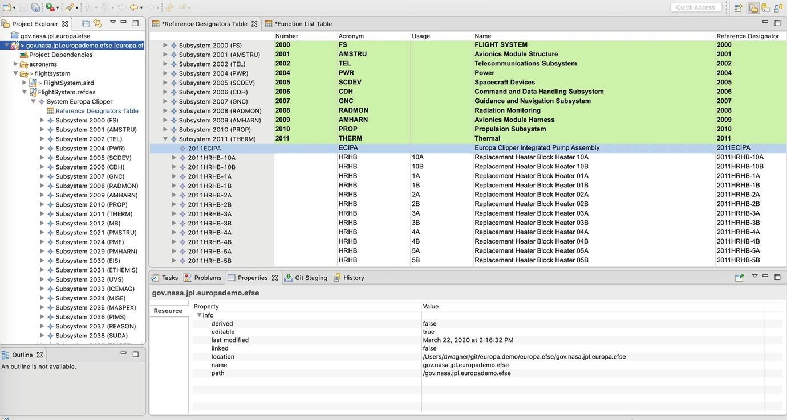
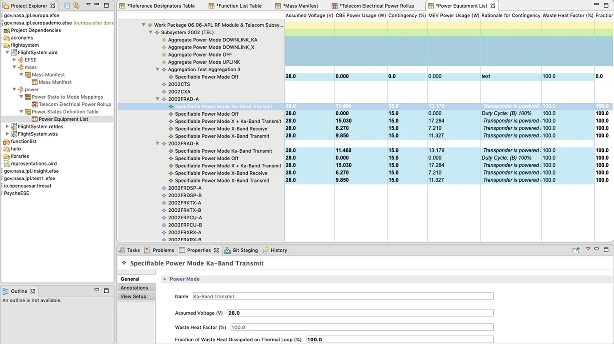
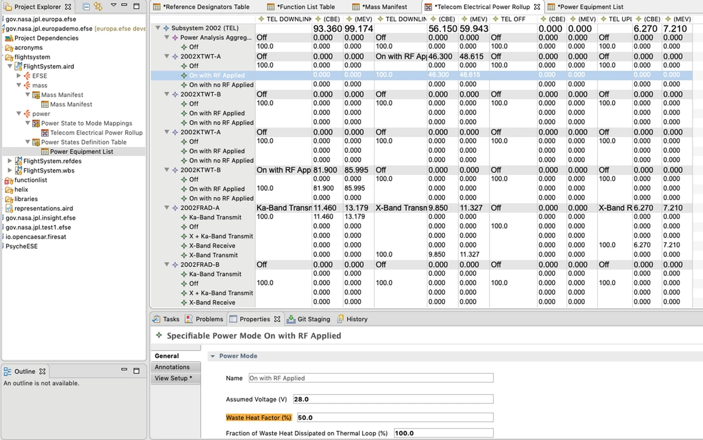
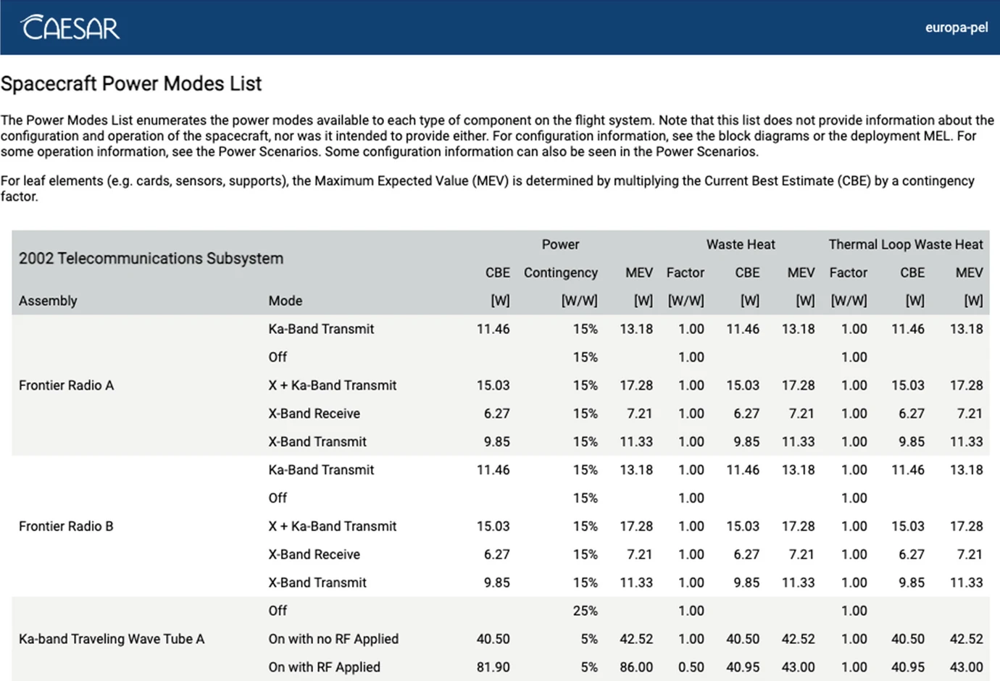
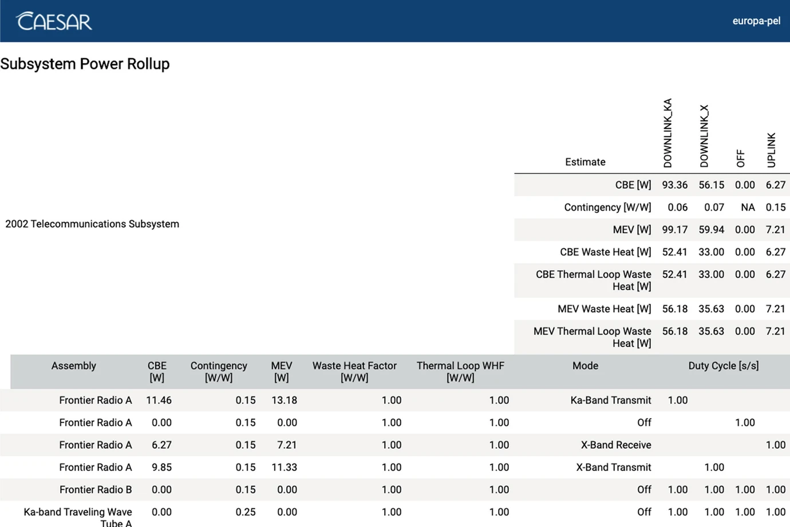

> [Wagner, D., Chodas, M., Elaasar, M., Jenkins, J.S., Rouquette, N., "Semantic Modeling for Power Management using CAESAR,” Handbook of Model-Based Systems Engineering, pp 1–18, 06 May, 2022.](https://link.springer.com/referenceworkentry/10.1007/978-3-030-27486-3_81-1)

## Abstract 
Model-based systems engineering (MBSE) aims to bring rigor to the products and methods used in systems engineering similar to the benefits that computer-aided design (CAD) technologies have delivered to other engineering disciplines. MBSE is most often associated with the Systems Modeling Language (SysML) and its associated tools. While SysML is being developed with the intent of making the practice of systems engineering more rigorous, it isn’t the only way to do it. This chapter describes an alternative approach to model-based systems engineering that leverages semantic web technologies to provide a more flexible platform for developing and managing descriptive system models in a rigorous manner. We describe a case study, in which this platform has been put into operations on a large project at the Jet Propulsion Laboratory to capture, validate, configuration manage, and report on power system sizing, which is a key systems engineering concern in the design of spacecraft.

## Keywords
CAESAR, OML, OWL, OWL2-DL, Semantic Modeling, Description Logic

## Introduction
Spacecraft need to be able to operate as autonomous and self-sustaining remote observatories: autonomous in that they must be able to perform their missions of collecting scientific data in situations where operators on the ground will not be able to see the results of their inputs until hours after everything has already happened and self-sustaining in that they must be able to either carry or produce all of the resources they will need to do so. In particular, spacecraft, as electro-mechanical robotic systems, need electrical power to drive the instruments, control electronics to do the work, and heaters to keep everything from freezing in the cold of space.

A key challenge in designing spacecraft is to provide enough electrical power to meet the demands of the mission using a minimum of mass and volume. Although the design of the solution is often assigned to a particular subsystem, it is usually a systems engineering responsibility to assess demands across the system in order to specify the needed performance of the power producing subsystem. At JPL this assessment is referred to by the name of the report that documents this assessment: the Power Equipment List or PEL.

In this chapter we will review a model-based approach to capturing and assessing power demands of a spacecraft using semantic web technologies and tools.

## Problem Statement
On the surface, simply adding up the power estimates from a collection of hardware does not sound very hard. This view has generally led projects in the past to use a simple spreadsheet to try to capture the power estimates. Spreadsheets make it relatively easy to add up columns of numbers, the tools are ubiquitous, and there is a very low learning curve. However, several other factors conspire to make the problem more difficult than it may seem. First, estimating the power demands of hardware that has not yet been built is not easy. Early on in the process, the hardware design may not yet exist. But the project cannot wait until all the power-using subsystems have been designed before starting to design the supply. Second, even if the hardware is well-defined, the power demands are going to vary widely with how the system is being operated. Instruments can be turned off when not in use. Thus, it becomes necessary to refine the demand estimates to also include scenarios describing how the hardware will be operated over time. In extreme cases such as the one reported here, full mission simulations are needed to assess demand over time. But most projects can simplify the problem to define a small number of system “modes” where each mode can be described by a single fixed operating state and load estimate for each demand assembly.

What is it that makes this a good candidate application for a model-based approach? First, let us not dismiss the spreadsheet as a model-based approach. There is still a model there even if it’s only a table of data, but the relationships between the numbers and the system they describe are only implied. A more general modeling approach is suggested by several factors. First, the shape of the data is not strictly tabular. In fact, there can be some hierarchical composition: electronic cards are contained in a chassis, and assemblies are aggregated by subsystem. The entries are highly regular, and the relationships are simple, but there can be a lot of entries. Thus, defining a schema or metamodel for this data is not difficult. But validating the consistency of the model is critical, and, since the data are updated frequently, this needs to be done frequently too, suggesting a need to automate the analysis.

## JPL, IMCE, and CAESAR
The Jet Propulsion Laboratory (JPL) is operated by the California Institute of Technology to conduct solar system research for the National Aeronautics and Space Administration (NASA). JPL’s Engineering and Science Directorate (ESD) manages the implementation of its space missions from formulation through implementation and operations including the systems engineering involved at every level of the process. ESD has funded research and development in model-based systems engineering (MBSE) through the Integrated Model-Centric Engineering project for over a decade. In 2017 ESD transitioned from sponsoring small, independent research tasks that were producing interesting proofs-of-concept to a more coordinated single approach named CAESAR. By combining some common architectural principles and frameworks to ensure that modeling capabilities can be federated along with a focus on developing the new methods and training needed to make improved tools usable in the workplace, CAESAR intends to develop integrated capabilities within the organization to support current and future projects.

CAESAR’s first application focused on the problem of spacecraft harness specification and design. As described in [1], this was a ripe target to apply a model to capture the specification and design data in order to make the overall process more efficient because of the large quantity of data having a very regular shape. That application delivered the following features:

- A vocabulary or metamodel that defines the shapes of the data to be captured
- An authoring tool that provides user interface forms for effectively capturing this data
- A model change management system based on Git
- A continuous integration workflow in which the model data can be automatically analyzed to produce review reports and assess formal completeness and consistency criteria

All of these features were developed on top of open-source tools and frameworks (including the Eclipse Modeling Framework) and open-standard languages and interfaces.

As described in the [Metamodeling chapter], large parts of the vocabularies, authoring platform, and continuous integration tooling developed by CAESAR have been open-sourced in the openCAESAR project.

The rest of this chapter will describe the second application CAESAR developed to support spacecraft power demands assessment on the Europa Clipper project at JPL. This application extends vocabulary, model, and tooling from an earlier application described in [1] that is currently supporting spacecraft harness specification on both the Europa Clipper and Psyche projects. The case study will focus primarily on the development of model vocabulary and methods rather than on the details of implementation because the hard part is not in building the tools, but ensuring that the tools are well suited to the problem.

## Case Study
### Europa Clipper Introduction
The Europa Clipper project is planning to send a spacecraft to study Europa, an icy moon of Jupiter. Europa is an interesting subject of inquiry because earlier missions have observed signs that there may be liquid water beneath its icy surface. Liquid water in the presence of chemical processes driven by an energy source such as Jupiter’s gravitationally driven tidal flexing could provide the right conditions to support life. The Clipper mission intends to make more detailed observations of the surface and subsurface conditions through the use of a spacecraft with remote sensing instruments. Europa happens to orbit Jupiter inside a plasma torus produced by an interaction between Jupiter’s strong magnetic field and solar wind. To minimize the spacecraft’s exposure to this radiation, it will orbit Jupiter such that it spends most of its time outside the plasma torus and only briefly dips in to make close flybys of Europa.

Clipper will be a rather large solar-powered spacecraft – only the second solar-powered mission beyond Mars that NASA has attempted. A key challenge with all spacecraft, but particularly ones using solar power, is to size the power-generating capabilities of the spacecraft to match the demand. Batteries can be used to some extent to buffer the discontinuities in time between when power can be generated and when it is needed, and this strategy is used on Clipper. However, at that distance from the Sun, solar panels have to be quite large to produce enough power to just keep the spacecraft from freezing, not to mention power the instruments and transmit data back to Earth.

Managing the balance of power between the demands of instruments, avionics, and thermal functions on the one hand with the generating capacity of the solar panels is a major concern during the design and development of such a spacecraft. Clipper’s challenge is particularly acute due to Jupiter being so far from the Sun which not only reduces its ability to generate solar power, but it increases the amount of power needed to transmit large amounts of data back to Earth. Clipper is a large spacecraft in part because of the number and complexity of its science instruments but also because its solar panels need to be large to collect enough energy to power them.

And then, the orbit that will preserve the life of the spacecraft’s electronics by keeping it out of the plasma torus only provides one opportunity to observe Europa each orbit and at the periapsis of the orbit where it will be travelling at very high speeds relative to Europa’s surface. This means that all of the close-up observations will occur in a short period of time as the spacecraft speeds by. Taking images at this point will require turning the spacecraft to precisely track the surface – another function that will consume power. And doing this will prevent the spacecraft from keeping solar panels aligned with the Sun at the same time.

All of these factors contribute to making Clipper one of the most power-hungry deep-space spacecraft ever designed. It would seem that supplying that power from solar energy is simply a matter of making solar panels as big as needed to provide the energy. But, the size needed to produce the constant power needed to operate the spacecraft with all its instruments operating would be too big to even get into space. Instead, the mission leverages a set of batteries and the long-period orbit to store energy collected during the outer part of the orbit to use during the busy flyby period.

Since Clipper’s power system cannot be sized to simply supply the power needed to operate everything at once, it becomes an energy management problem where the supply needs to be sufficient to keep batteries charged to a safe level in the face of loads that come and go over time. This means that sizing the system can only be done in the context of scenarios that also estimate how the system will be operated over time through the use of simulation.

Sizing a power system is further complicated by the fact that many of Clipper’s functional elements are being designed uniquely for this mission. While some common parts such as certain sensors and actuators, computers, radios, and reaction wheels may be acquired off-the-shelf and have known power consumption properties, many other parts including science instruments will be custom made. Power demand drives how much power will have to be produced, so practice dictates that estimating the demand is something that has to begin in the earliest concept studies and continue to be refined throughout the mission.

Before hardware has been manufactured and tested, these estimates must account for the uncertainties associated with design and development. Early designs must account for the uncertainty of precisely how something will be operated, its environment, what parts will be available, and how they will perform. Common practice is to record such estimates using something close to a statistical model by capturing a current best estimate (CBE) representing the most likely value based on current knowledge and a maximum expected value (MEV) representing the outlying tail of a distribution curve. Since engineers are not good at estimating probabilities such as these, design rules often dictate simple contingency factors as a function of where the project is in its lifecycle to compute the MEV value from CBE. Ideally, the power system would then be designed to the MEV value, and any difference between that and where CBE eventually ends up is design margin.

### Modeling Scenarios
The project took a two-pronged approach to modeling and validating operational scenarios. Both approaches relied on using a common set of component power load estimates captured in a system model. The first approach relied on a set of simulation models. More than one simulation model was used because there was no single tool ideally suited for all of the analyses under consideration. One model focused on modeling aspects of plan coordination, and another on aspects of science observations and surface coverage. Some models were able to better leverage existing model fragments or libraries which provided validation for other models.

The second prong of the approach was to use a simpler traditional method to abstract these system behaviors into a small number of system modes where each mode can be described as a set of quasi-steady-state behaviors for the entire system. Some elements can be described as either ON or OFF in a given mode. Other elements with more dynamic operational properties can be described using simple duty cycle descriptions as toggling between ON and OFF or between a set of other steady-state modes. Instead of focusing on behavioral accuracy, these estimates were intended to bound the worst-case power behavior in each system mode as a bounding validation to the simulation models which were much more detailed, took much longer to update and execute, and were much harder to validate on their own.

### Modeling Waste Heat
Keeping propellant from freezing and keeping electronics above their minimum operational temperature limit is another major use of energy on a spacecraft in the outer solar system. Direct heating from the Sun does not help much out at Jupiter. Spacecraft use electrical heaters to deliver energy to parts such as propellant tanks that have no other source of energy, and they also rely heavily on the “waste” heat produced by the functioning of electrical components. The heat generated by those components is transmitted through direct conduction or, in the case of Clipper, a thermal fluid loop, from areas where electronics render heat to areas where it is needed. Because sizing the thermal system is as important as sizing the power system and the fact that these two systems are closely coupled, it is helpful to track the amount of electrical power that every component converts to heat in the same model where the power estimates are tracked. Most components dissipate virtually all of their electrical energy input as heat. Radio transmitters, on the other hand, radiate significant amounts of energy away from the spacecraft; this energy is no longer available as local heat.

### CAESAR PEL Application
As the Clipper project was approaching the end of its design phase, it began to realize that all of the modeling and simulation capabilities it had developed were costing a lot to maintain. The CAESAR team was brought in to provide institutional resources to identify those parts of what Clipper had developed that could most effectively be made reusable for other projects and to make them so.

Through a collaborative effort with the Clipper project, the CAESAR team identified the modeling and management of power load estimates as a highly reusable function in need of standard tooling and method. Clipper was capturing this information in a SysML model that, due to its size and complexity, could only be updated by expert modelers and, even then, required significant effort on their part to input and validate the information. They had developed methods to project that model data into tabular views using OpenMBEE [2] that the rest of the project could then use to review the data. Editing in SysML was complicated by the fact that the graph of dependencies between thousands of model elements was very difficult to edit through SysML diagrams graphically as the diagrams become too large and unwieldy or, if information is split across multiple diagrams, too difficult to keep consistent between them. This cycle of updating and reviewing the model consumed an excessive amount of resources compared to using a traditional spreadsheet to track power load estimates. However, it did have the advantage of ensuring well-formedness of the model once the updating and reviewing cycle was complete. The CAESAR team set out to provide a solution for tracking power load estimates with the rigor of the SysML model-based approach and the ease of maintenance of the spreadsheet-based approach.

### CAESAR PEL Vocabulary
The CAESAR PEL vocabulary is designed to address the stakeholder concerns associated with a Power Equipment List (PEL), including providing information about power usage to the power subsystem in order to ensure that sufficient power could be produced and providing information about heat generation to the thermal subsystem in order to ensure that temperature requirements would be met. The vocabulary is only sufficient to describe the quasi-static, mode-based modeling approach that is used to bound the simulation model output.

CAESAR PEL assigns power usage to components that present electrical interfaces which correspond to entities of type fse:Assembly in the vocabulary established in [1]. Power usage changes over time, and in keeping with traditional practice, CAESAR PEL characterizes the power usage of an fse:Assembly using a finite set of power modes. A pel:powerMode is defined as a set of constant-valued constraints on the state variables that describe the power usage of an fse:Assembly. CAESAR PEL assumes that the power usage of an fse:Assembly is quasi-static in each mode and that an fse:Assembly can only be in one mode at any point in time.

Power usage is not precisely known, especially early on in the life cycle. CAESAR PEL reflects that uncertainty using the three traditional resource usage parameters: Current Best Estimate (CBE), Contingency, and Maximum Expected Value (MEV). CAESAR PEL defines CBE as the responsible authority’s best estimate of the power usage of an fse:Assembly in a certain power mode in the expected operating environment. Contingency is defined as the responsible authority’s best estimate of the fractional increase in the power usage of an fse:Assembly in a certain power mode incorporating reasonable worst-case assumptions and other uncertainties. MEV is defined as the responsible authority’s estimate of the power usage of an fse:Assembly in a certain power mode given reasonable worst case assumptions and incorporating other uncertainties. These properties are implemented as constant-valued constraints on state variables corresponding to CBE, Contingency, and MEV power usage estimate state variables that characterize each fse:Assembly.

To address thermal concerns, CAESAR PEL can describe the heat that is produced by any fse:Assembly. The Waste Heat Fraction is defined as the fraction of the estimated power usage that is dissipated as heat. The Waste Heat Fraction can be applied to either the CBE or MEV power usage value to determine CBE and MEV Waste Heat estimates. For missions with a fluid loop like Europa Clipper, the amount of heat being dissipated on the fluid loop needs to be tracked separately in order to track how heat moves throughout the system. Therefore, CAESAR PEL defines a property called the Fraction of Waste Heat on Thermal Loop. The amount of heat being dissipated on the fluid loop can then be calculated by multiplying either the CBE or MEV power usage estimate by the Waste Heat Fraction and the Fraction of Waste Heat on Thermal Loop. These thermal properties are implemented as constant-valued constraints on state variables corresponding to the CBE and MEV Waste Heat and Heat on Thermal Loop state variables that characterize each fse:Assembly.

The CAESAR PEL vocabulary describes several different types of pel:powerModes. Modes for which CBE, Contingency, and MEV are directly specified by the user are defined as pel:SpecifiablePowerModes. However, the CBE, Contingency, and MEV power usage estimates can also be defined using a mapping to other power modes. For example, a pel:PowerMode that characterizes an entire flight system is traditionally defined by specifying the power mode or modes that all components within that system are in. Therefore, CAESAR PEL also defines a type of power mode called pel:AggregatePowerMode whose CBE, Contingency, and MEV are defined via a mapping to other power modes. CBE, Contingency, and MEV power usage for pel:AggregatePowerModes is calculated using a sum of the power usage properties of the mapped power modes, weighted by a duty cycle.

CAESAR PEL can also capture other information related to the power usage estimate including the voltage assumed when computing power usage and the rationales for why a certain value for CBE or Contingency was chosen by the user. These other properties are implemented as characterizations of each pel:PowerMode.

Some PEL information consumers analyze power usage information in the context of system decomposition trees. For example, thermal subsystems engineers are concerned with where heat is being produced within the system and therefore would like to view the PEL within the context of the mechanical composition tree. Systems engineers are concerned with verifying that power usage estimates are within allocated values and so would like to view the PEL in the context of the Work Breakdown Structure (WBS). To support these and other concerns, CAESAR PEL has the capability to relate power usage to various system composition trees.

The electrical systems engineering vocabulary introduced in [1] is able to describe the mechanical composition of the system by declaring that an fse:Assembly base:contains one or more fse:Assemblies. Therefore, once power usage information is known for all leaf fse:Assemblies in the system (that is, fse:Assemblies that do not contain any fse:Assemblies), power usage for any other fse:Assembly can be calculated by summing along the edges of the mechanical composition graph.

To express the work breakdown structure for a project, several new concepts were introduced as part of the project ontology [3]. A project:WorkPackage is a discrete unit of project cost, schedule, or activity. Project:WorkPackages can project:authorize or delegate authority to other project:WorkPackages, establishing the Work Breakdown Structure. The responsibility for a Work Package to deliver hardware for a project is described by saying that a project:WorkPackages project:supplies an fse:Assembly. Therefore, once power usage has been estimated for all fse:Assemblies in the system, the power usage of fse:Assemblies that any Work Package is responsible for can be determined by summing over the joint graph of project:authorizes and project:supplies relationships.

### Advantages of the CAESAR PEL Vocabulary
The vocabulary described in the previous section is arguably more precise than the SysML equivalent because all of the relations are explicitly meaningful where the SysML implementation merely implied meaning in SysML dependencies. It does this with simpler, more concise syntax, yet the higher precision makes it easier to write portable rules and analysis. And those analyses can be more rigorous at lower cost since they can be reused where analyses written against SysML models with implied meaning cannot. The vocabulary and patterns defined above imply several properties that can be checked automatically using an automated reasoner. The properties can be divided into two categories: range restrictions on values of properties and topological invariants. The properties are all checked by an automated reasoner during analysis of the model as described in a subsequent section.

The definitions of the various power usage estimates and other properties imply limits on the range of the values that they can take. The CBE, Contingency, and MEV properties all need to be greater than or equal to zero. The Waste Heat Fraction and Fraction of Heat to Thermal Loop properties need to be between zero and one inclusive. Similarly, the duty cycle value for any power mode that is mapped to another power mode needs to be between zero and one inclusive. Additionally, for each mapping from a set of power modes to an pel:AggregatePowerMode, the sum of the duty values for all modes of each fse:Assembly that participates in the mapping needs to be equal to one.

The set of power mappings forms a tree with each system power mode at the root. Trees have topological invariants that can be leveraged to guarantee that the power usage of each leaf component is counted exactly once when summing power usage for a system power mode. A graph is a tree if it is directed, acyclic, connected, and rooted. Directionality is needed to uniquely define the summations along edges. Acyclicity guarantees that each power mode in the graph is counted at most once. Connectedness guarantees that each power mode in the graph is counted at least once. Rootedness guarantees that there exists a level of the tree for which the power summations describe the entire system. If these four properties hold for the graph, then summing the power usage along edges of the graph from leaf components to the root is guaranteed to accurately compute the power usage of the system power mode. While the graph theoretic constraints (e.g., acyclicity) are beyond what can be expressed in description logic (and therefore in OWL 2 DL and OML), the formal representation in terms of nodes and edges makes it convenient to query the graph and subject it to analysis by external tools, e.g., one of many software graph libraries.

The corresponding modeling patterns in SysML can be complex because SysML cannot express all of these relations unambiguously without being extended and, because SysML is authored through diagrams, relationships stretch across multiple diagrams, making them difficult to inspect, verify, and maintain. For example, consider how a mapping between assembly power modes for assemblies that make up an instrument and that instruments’ power modes was expressed in SysML. Assembly power modes were defined in SysML using states in a State Machine diagram. Instrument power modes were defined using states in a different State Machine diagram. The assembly power mode to instrument power mode mapping was made with the aid of diagrams (one per instrument mode) populated with swimlanes. These swimlanes were very laborious to update due to the number of relationships, stereotypes, and elements involved. In addition, relationships between these diagrams and instrument modes, work packages, and analysis characterizations had to be maintained.

## Implementing the CAESAR PEL
CAESAR PEL extends the model and continuous integration architecture established for harness specification modeling in CAESAR by adding the ability to characterize fse:Assembly elements with power modes and relate those power modes in a graph. CAESAR architecture separates authoring from reporting and analysis which is done in a continuous integration process downstream of authoring and outside of the authoring tool.

### CAESAR Authoring Workbench
Authoring power modes and associated power estimates has traditionally been performed using whatever ad hoc tools and methods were closest at hand, most often a spreadsheet. The CAESAR team opted to adapt its model authoring tool to this set of viewpoints. The CAESAR workbench is a desktop application based on the popular Eclipse Modeling Framework (EMF) [4] which was itself developed to support the implementation of model-based applications. EMF provides tools needed to encode the underlying vocabulary into a metamodel or schema for the application and then project model information into table-based or form-based views with which users can interact.

The CAESAR workbench had previously been adapted for authoring abstract electrical interconnections used to specify harness design for Europa, including authoring the electrical assemblies to be connected. The same view and underlying model are extended to add the ability to characterize the power modes and associated loads for all electrical assemblies (the model also supports identification of non-electrical assemblies). Figure 1 shows how the composition view presents a list of assemblies grouped by subsystem in a spreadsheet-like presentation showing identifying attributes in the columns.

Additional authoring views are provided for capturing assemblies’ power modes and estimates (Fig. 2) and the modes and mode mappings. This view is populated with every assembly defined in the composition view and allows the user to add power modes and associated power estimates to each assembly (not all assemblies consume power so not all will have power modes).

Another view (Fig. 3) enables the creation of subsystem modes. Subsystem modes provide a way to associate behavioral modes of assemblies contained in a subsystem with a common functional behavior in order to somewhat simplify the task of mapping system modes to the behaviors of individual assemblies. For completeness, each subsystem mode needs to map at least one assembly mode for each contained assembly. At the system level, each system mode must then map to at least one subsystem mode for each subsystem or to at least one assembly behavior mode for every assembly in a subsystem where a subsystem mode is not used. In essence, every system mode must map to at least one assembly mode for every assembly that has power behavior. CAESAR PEL allows the modeler to use subsystem power modes as an intermediate step in that mapping.

Note that in all of these views, the user is permitted to enter data via the tabular perspective (spreadsheet-like) or through a form perspective in the Properties tab, below, for the selected row.

### Power Analysis Workflow
Continuous integration is supported by the CAESAR architecture through the concept of a workflow that can export one or more source models, transform the data to a common OWL representation, validate consistency of the input models and generate entailments, store the resulting model data in a SPARQL endpoint, and then perform a set of queries, data reductions, and analysis needed to render user-friendly reports and documents. The intent of this is to provide feedback to both the authoring users and their wider information consumers regarding the current content of those models but also their consistency and completeness.

SPARQL query results can be requested in multiple well-known syntactical forms, including CSV and JSON. For this application, JSON results were post-processed into a form suitable for import into the popular data analysis language R. All reductions and reports were produced using various R libraries.

Certain fatal inconsistencies such as mismatched references and cyclic dependencies are trapped in the authoring workbench to prevent these inconsistencies from ever being published or even saved. An integration workflow can begin when a user saves and commits a new formal version of the model through the configuration management view (CAESAR workbench uses git as the underlying CM system). The user can then manually trigger the workflow to begin on the user’s working branch of the model. This usually results in a set of reports being generated from that commit of the model (the model validation that takes place in the workflow will occasionally identify an inconsistency that the workbench or other tool failed to notice). These findings generally lead to fixes to the model vocabularies or associated tooling that will reveal errors to users during authoring or simply prevent them from being created.

The workflows are implemented using the openCAESAR tools described earlier, adaptations of those tools that perform custom model transformations, adaptations of the reporting frameworks to create reports, and some scripting needed to containerize the steps and run it all in Kubernetes. As noted earlier, CAESAR makes a distinction between violations of different kinds of constraints. Constraints can be asserted in vocabularies at the linguistic level or in the descriptive model itself. The latter includes constraints expressed by the project that total power consumption for a spacecraft can never exceed a given capacity. The former includes a rule asserting that power load estimates need to express positive quantities in a unit of power or that power modes can only be attributed to assemblies. This layering gives projects control over constraints they need to control while allowing generic constraints to be asserted in reusable vocabularies or libraries. Also, a violation of an analytical constraint within the model is something to be reported to users as work to go. A violation of a linguistic constraint implies that the model is ill-formed and its analysis results are suspect. 

Report views are intended to project model data into presentations that are meaningful to the various consumers of the information. Some reports present information in a form amenable to management review, while others focus on identifying missing, incomplete, or inconsistent with analytical constraints. Some of these reflect forms similar to the authoring viewpoints presented in the workbench but optimized for consumption rather than authoring (Figs. 4 and 5).

In addition to generating all of the reports as HTML documents published to a web server alongside their harness specification peers, all of the PEL reports were also published as OpenMBEE views to the OpenMBEE document Europa users were used to using to find this information. Since the reports are essentially the same HTML data structures and only differ by their containment in a larger document, this was mostly a matter of creating a single new adapter to write the content to OpenMBEE.

## Chapter Summary and Future Updates
Formally characterizing different behaviors in a consistent way is only the first step enabling the analysis of those behaviors needed to identify a satisfactory design solution for a spacecraft. Most spacecraft include the ability to store power when it can be produced for use at a later time when it can’t. Assessing the balance between demand and availability thus requires simulation over time to integrate the asynchronous contributions. The Europa project has developed a number of simulation capabilities [5] that can integrate both energy and data for this purpose. As a next step, the CAESAR team is looking at developing similar capabilities to use the configuration-managed characterizations of power modes and associated demands, combine that with models of scenarios that describe how those modes are invoked over time, and feed that all into a simulation engine that can perform the integration. The simulations can then integrate relevant trajectory and environmental factors (i.e., solar range and eclipses that affect solar power production) to determine power balance and battery state of charge over time.

Extending the system characterization to include data production/consumption behaviors would enable similar simulation analysis of data balance over time (spacecraft typically store and forward data to the ground as communication links are available and those links are typically asynchronous to the observation events that produce the data of interest).

Engineers have had access to a wide variety of tools and languages for describing and analyzing systems for some time, but they often have to choose between a solution that can directly support the needed mathematical analysis and a solution that can precisely describe the system that the math abstracts. E.g., Mathematica or even Excel can capture mathematical relationships, but they have little means to associate variables or cells to real-world objects in order to help modelers organize and manage the data. Languages like SysML can describe some of the system objects and relations, but cannot directly solve the math. Semantic modeling focuses on describing the system in a way that permits the model to be related to or transformed to other analytical viewpoints. Rather than look for a single solution to every problem, semantic modeling aims to federate diverse models through common vocabulary, modeling patterns, and rules. In this case the analysis is performed in a number of queries and scripts, but the project has also demonstrated the ability to transform from descriptive models into Modelica form to run high-precision simulations.

Most engineering organizations have some combination of tools in place that provide reasonably effective ability to describe parts of the system. Mechanical and electrical CAD tools, for example, have evolved over several decades to become very effective at capturing and analyzing geometric objects and constraints. These tools have already evolved the vocabulary and automation for their disciplines. But connecting those silos of information and capturing aspects of how these design viewpoints combine to make a system are not so well established – at least as commercial products – in part because every system is different.

But the approach still applies to the problem of describing how concepts and relations from one discipline map to those of another, providing the vocabulary needed to compare, for example, architecture with design or mechanical design to thermal design. While it may be possible to connect data from tool to tool by more superficial means, such solutions are often brittle or difficult to maintain as all of the interpretation and transformation logic is hidden in imperative code that is difficult to analyze and review. When the mappings are instead expressed as vocabularies, they can be validated using off-the-shelf reasoners and transformations, queries, and other analysis that can be expressed in simpler, more maintainable forms.

The case study demonstrates that the CAESAR platform provides an effective way to implement discipline-specific model authoring tools, change control the model information in git, and feed this data into a continuous integration process that can validate the essential consistency of the data, provide regular feedback to authors on completeness and consistency with external constraints expressed in other models, and publish reports for consumption by downstream consumers.

## Acknowledgement
Some of the work described here was performed at the Jet Propulsion Laboratory, California Institute of Technology, under a contract with the National Aeronautics and Space Administration.

## References

1. Wagner et al (2020) CAESAR model-based approach to harness design. IEEE Aerospace conference 2020.

2. OpenMBEE https://www.openmbee.org/

3. OpenCAESAR Project Ontology https://github.com/opencaesar/jpl-vocabularies/blob/master/src/oml/imce.jpl.nasa.gov/foundation/project.oml

4. Eclipse Modeling Framework https://www.eclipse.org/modeling/emf/

5. Ferguson, Eric W., et al. (2018) Improving spacecraft design and operability for Europa Clipper through high-fidelity, mission-level modeling and simulation. 2018 SpaceOps Conference.