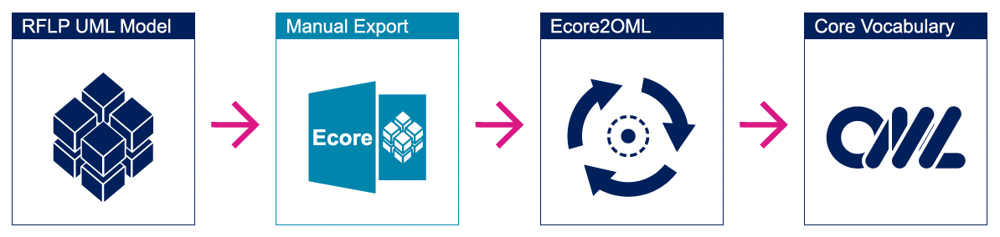
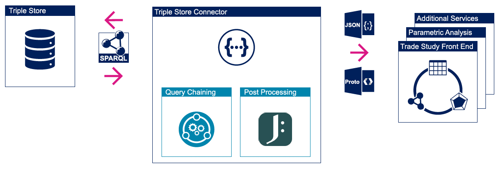
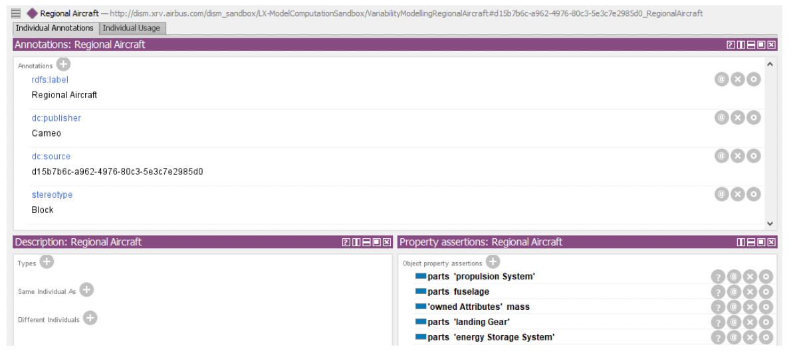
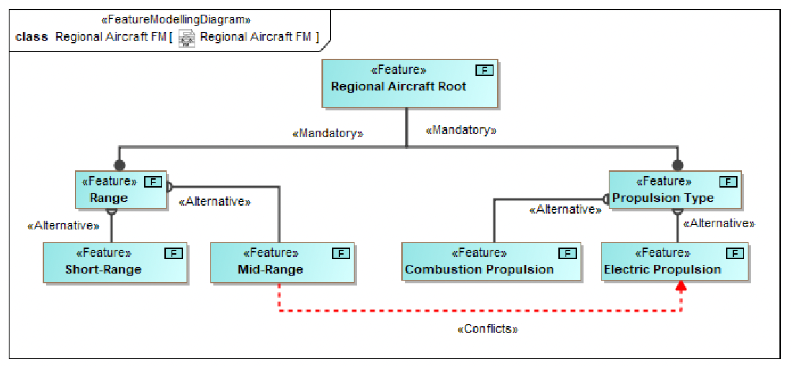
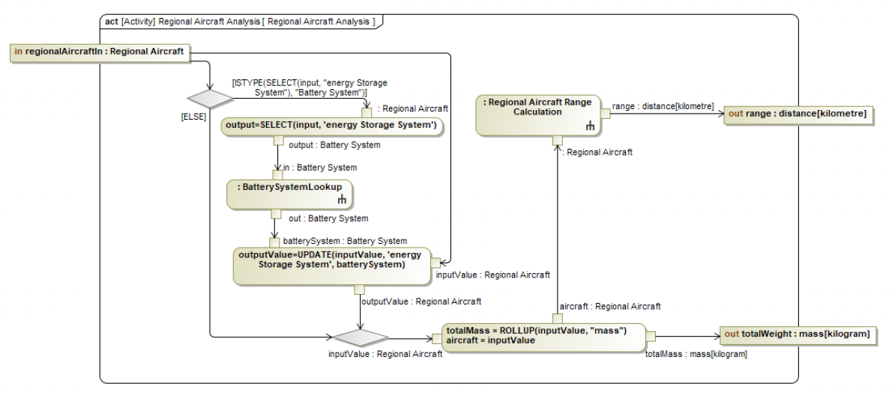
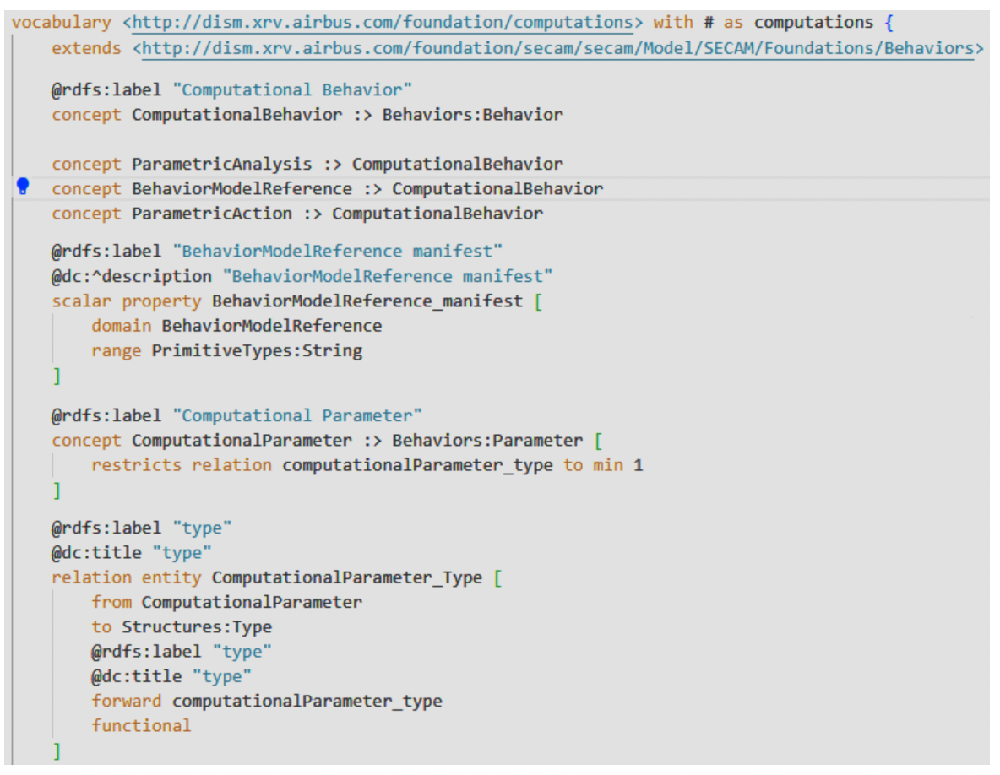
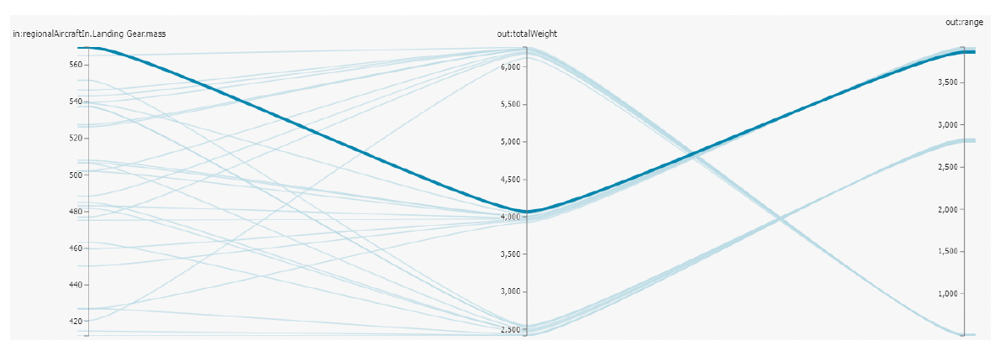

> Zindel, A., Feo-Arenis, S., Helle, P., Schramm, G., and Elaasar, M. "Building a Semantic Layer for Early Design Trade Studies in the Development of Commercial Aircraft,” Proceedings of 8th IEEE International Symposium on Systems Engineering (ISSE), Vienna, Austria, Oct. 24-26, 2022.

## Abstract
To improve the adoption of Model-based Systems Engineering (MBSE), data that is distributed across engineering disciplines needs to be made available in an open and descriptive way. This paper describes a new approach to implementing a semantic layer that allows integrating and publishing MBSE data stored in heterogeneous models in a uniform way by means of Semantic Web Technologies. The tool-independent views on engineering data provided by the semantic layer enable the implementation of services for accessing, classifying, checking and reuse of federated information. We report on the creation of a common vocabulary in the Ontology Modeling Language (OML) that can be automatically instantiated from distributed models into a knowledge graph. We describe a use case using Systems Modeling Language (SysML) to demonstrate the benefits of our approach in the early design trade studies in the aeronautic domain.

## I. Introduction
In this paper, we demonstrate how MBSE data stored in
models can be published in a uniform way. However, the
benefits of solely publishing the data will be limited without
the help of an additional layer that allows to classify, check,
find and process the published entities. This is partially due
to the fact that data produced by authoring tools like, Cameo
are hard to understand even for users that are familiar with
the information stored in the data sets. A possible consumer
does not only need to have knowledge about the concepts
of the source language but also the data model and structure
deployed by the software that manages and stores these data.
This limits the usefulness and reusability of the model data,
even if accessible, for developers and attached services.

This results in a need to publish the native data encoded
in an enhanced format that is easier to share, traverse and
consume than the initial data model published by the tool the
MBSE data originates from. To achieve this, we transform the
raw data into a knowledge graph with the help of Semantic
Web Technologies.

To implement the semantic layer, we created a process
that publishes the data by means of a generic systems engineering
data model based on a Requirements-Functional-
Logical-Physical (RFLP) model that is the top-level ontology
structuring the MBSE data hub. This is supported by the
Ontology Modeling Language [1] in order to establish a
common vocabulary to encode RFLP data while maintaining
traceability.

OML is supported by a set of tools [2] that enabled
developing a common vocabulary in the form of an ontology
to support our particular RFLP methodology. The
tools allow the developers to describe the data model in a
formal language with a simplified textual representation, thus
maintaining mathematical rigor enabling formal analyses down
the road. The resulting vocabulary can then be instantiated
via automated adapters that translate tool-specific data into
common concepts, thus populating the envisioned knowledge
graph integrating engineering data from federated sources.

With this approach, we establish an MBSE driven product
development cycle that is not limited to a single source of
truth controlled in the modeling tool, but that liberates the
data and allows for the integration of other sources. This brings
about benefits that would not be available otherwise such as
the automated execution of behavior model networks, and the
automated optimization of architectures.

This paper focuses on the creation of the common vocabulary,
the automated instantiation of the knowledge graph and
its utilization in trade studies during the early design phases.

This paper is structured as follows: in Section II we discuss
the need for supporting the development of models in the aeronautic
domain with the help of Semantic Web Technologies.
In Section III we provide background information about the
used methods and technologies. Section IV provides details
about how we use these methods to build the semantic layer.
Lastly, in Section V we conclude by critically reviewing the
presented work.

## II. Motivation
The life cycle of a typical commercial aircraft can span
over 45 years [3]. This includes a 5 -10 year product and
development phase (the so called Product Development Plan
(PDP)), a 20-year production phase in which new units (socalled
Manufacturer Serial Numbers (MSNs)) are produced
and a 35+ lifespan of the individual MSNs that is supported
by the manufacturer.

Given such long lifespans, getting the design right for the
product is crucial for its financial performance. Changes late
in the life cycle are costly.

In such an environment, the term Do It Right the First Time
(DRIFT) becomes an important mantra when developing new
products: as a developer and manufacturer of commercial aircraft,
wrong decisions early in the development can potentially
harm your product, and by proximity your company, for the
next five decades.

This is where MBSE comes into play. Deploying MBSE
during the whole lifetime of a project can significantly reduce
the risk of costly reworks in later phases of the System
Development Life Cycle (SDLC) by detecting errors in the
early phases [4]. Thus, the early design phases of a new
product have a prominent spot since you can iterate through
more radical designs and solutions before refining the design
in the later stages of the PDP.

In this paper, we are describing a novel approach to the
implementation of a semantic layer that can support the
specification and test of the product in the early design phases
with the help of Variant Analysis (VA). The actual process
for defining such trade studies is presented in [5], while the
underlying IT architecture is captured in [6].

Trade studies are key for product development because they
allow the design team to evaluate different design solutions
and evaluate them by finding best-in-class solutions [7]. Trade
studies allow for the earliest available evaluation of data
created in the initial stages of the product development phase.

We propose a concept for a semantic layer that manages the
retrieval and reusability of data assets. This is a key building
block in achieving digital continuity and provides a method
for connecting different disciplines together by providing
an entry point for non-system-engineering-based tools and
services. The semantic layer acts as the single authority that
incorporates multiple sources of truth.

To demonstrate these benefits, we developed a tool for trade
studies that uses the semantic layer to provide configuration
methods for said studies in a web front end fed by MBSE
data stored in the semantic layer. The concepts proposed in
this paper are a starting point for building an MBSE-based
data hub supported by semantic technologies that inhabits the
role of a virtual twin moving alongside with the development
of the MBSE models supporting the progression of the product
along its complex development life cycle.

## III. Backgorund
### A. Model-based Systems Engineering and SysML
Recently, MBSE emerged as a trend in complex systems
engineering with expectations that it will help manage the
increasing complexity and reduce the development time of
complex systems [8]. It is expected to ”become the ’norm’ for
systems engineering execution” [9] and ”is rapidly emerging
in the aerospace industry as the predominant way to practice
the synthesis and architecture development for complex systems”
[10].

The Unified Modeling Language (UML) [11] is a standardized
general-purpose modelling language in the field of
software engineering and the SysML [12] is an adaptation of
the UML aimed at systems engineering applications. Both are
open standards, managed and created by the Object Management
Group (OMG), a consortium focused on modelling and
model-based standards.

Neither UML nor SysML define complete model execution
semantics in their core specification. This is different from
modelling and simulation languages, such as Modelica [13],
which specify the syntax (textual notation) as well as the
execution semantics. However, work is underway to resolve
that [14]–[16]. Meanwhile, SysML tool suppliers often provide
their own execution semantics [17], so it is possible to include
action code into models, generate code from the models and
then execute them.

### B. Semantic Integration
Semantic (Data) Integration describes the process of integrating
data different semantic domains with the help of
semantic web technologies [18]. One such technology stack
for Semantic Web Technologies is proposed, standardized and
maintained by the World Wide Web Consortium (W3C). Since
these technologies are important for the comprehension of this
paper, we give an introduction to the Semantic Web Stack
(namely Resource Description Framework (RDF), Web Ontology
Language (OWL) and SPARQL Protocol and RDF Query
Language (SPARQL)), key areas for semantic integration and
technologies that build on top of these concepts like (OML).

a) Semantic Technologies: RDF is the W3C standard
model to represent information in the Semantic Web [19]. The
base element is a Subject Predicate Object (SPO)-triple. Each
part of the triple is represented by either an Internationalized
Resource Identifier (IRI), a data type literal (to store discrete
values) or a blank node (subjects or objects that do not have a
IRI or literal). A set of triples is called an RDF graph. Triples
are used to express descriptions of resources but are rather
unstructured without the use of standardized RDF vocabularies
that provide re-usability for RDF graphs.

One of these standardized RDF vocabularies is
OWL [20]. OWL is used to build ontologies to
represent knowledge. To achieve that OWL provides
concepts for classes (owl:Class), properties (e.g.
owl:ObjectProperty, owl:DatatypeProperty),
constraints (e.g. owl:maxCardinality) and axioms
(e.g. owl:disjointWith). The ontology forms the
terminological knowledge and is captured in the terminology
component (TBox) while the instantiated individuals of these
concepts are captured in the assertion component (ABox)
[21]. Specialized tools for creating OWL based ontologies
exist such as Prot´eg´e [22].

The full implementation of OWL (called OWL Full) can
be divided into several sublanguages or fragments that vary in
expensiveness depending on the available constructs. One of
these fragments is OWL-DL that implements the SROIQ(D)
Description Logic [23]. Since OWL-DL represents a set of
formal statements of assertions, algorithms (so call reasoners
or reasoning engines) can be implemented that can check if the
knowledge base is consistent or derive new statements from
already existing facts (so called inference). One way to model
such inferences is the Semantic Web Rule Language (SWRL)
[24]. It is important to keep in mind how these logics and
reasoner work internally when implementing the ontology. I.e.
the full implementation of OWL is undecidable which has
the implication that the reasoner will not terminate. All OWL
fragments run under the Open World Assumption (OWA).

Lastly a query language is provided that allows to extract
data out of the knowledge base. The W3C recommendation
is SPARQL which is a graph pattern matching language for
RDF [25]. SPARQL provides a standard set of functions
comparable to other query languages for traditional, i.e.,
relational, databases like the Structured Query Language. Additionally,
the language provides methods to traverse the RDF
graph. Databases (specialized storage solutions for RDF data
are called triple stores), tools and Application Programming
Interfaces (APIs) that can store and manipulate triples usually
provide an interface to execute SPARQL queries. In order
to achieve fast query execution times queries should run on
explicit facts if possible. To achieve this a process should
materialize the implicit facts a reasoner generates before
executing the queries and not at query runtime.

b) Ontology Modelling Language: The Ontology Modeling
Language [1] supports a methodology for using Semantic
Web ontologies in the context of systems engineering. The
design of OML is inspired by the OWL Description Logic,
and SWRL. Specifically, the OML syntax is mappable to a
set of patterns expressed in a subset of those languages, while
its logical semantics is derivable from those of the subset.

An OML ontology has a unique namespace that reflects the
provenance of the information defined by it. OML defines four
kinds of ontologies: vocabulary, vocabulary bundle, description,
and description bundle. The first two allow defining terms
used in a given domain and the logical rules that govern them,
while the second two allow using terms from some vocabulary
to describe information in that domain.

An OML vocabulary defines terms of a given domain (or
methodology). Such terms represent the domain’s types, their
properties, and their interrelations. They can specialize and
restrict more general terms creating taxonomies that allow
describing information at different levels of abstraction. While
terms have implicit logical rules that allow inferencing entailed
information from asserted one, such rules can also be
augmented by explicit ones defined by the vocabulary. Such
inference rules make an OWA, which states that what is not
known to be true is unknown.

An OML vocabulary bundle aggregates one or more vocabularies
and adds the Closed World Assumption (CWA)
when reasoning with them. This is achieved by implicitly
declaring concepts in such vocabularies that are not related
by specialization as disjoint. This makes vocabulary bundles
good for defining methodologies that can be used to reason on
systems. It also allows checking that types in a methodology
are satisfiable (conforming instances can be defined).

An OML description allows using vocabularies to describe
system information in terms of instances of types and assertions
on the values for their properties and interrelations. A
description makes the OWA, which allows it to be an extensible
fragment that can be combined with other descriptions in
multiple datasets about a system.

An OML description bundle aggregates one or more descriptions
in a dataset and adds the CWA when reasoning
about them (what is not inferred by the bundle is assumed
not to be true). Reasoning on a description bundle includes
checking conformance to the rules of the used vocabularies
(including rules like max cardinality that require CWA) and
the lack of logical contradictions (the existence of a statement
and its opposite).

C. Other Research in this Field
Other research that combine MBSE with semantic technologies
can be grouped mainly into three areas: using SysML to
create ontologies without natively implementing them in the
Semantic Web Technology stack, using ontologies to develop
a Digital Twin (DT) of an already existing system or a system
that is currently in the planning stage and integrating semantic
technologies into system engineering applications.

The first approach usually uses one of the SysML or
UML diagram types to model an ontology with the help
of elements of the modelling language. Most commonly
used diagram types are requirement- [26] or class-diagrams
[27], [28]. Most commonly these approaches use blocks to
represent concepts, while the block’s properties are used
to create data properties and connections between blocks
are used to represent the relations between concepts. As
a last step a conversion process translates the diagram description
into valid OWL-concepts (such as owl:Class,
owl:DataProperty, owl:ObjectProperty). Such approaches
can help to capture the knowledge of the domain
experts who are not fluent with Semantic Web technologies
but are able to operate other modelling tools they use in their
daily work such as Cameo.

In the second approach data stored in MBSE models are
transformed into a semantic representation of a DT. For this
a specialized engineering ontology like graph, object, port,
property, relationship, role (GOPPRR) is implemented that
allows you to convert the model data into a knowledge base
[29], [30]. The resulting knowledge base can then be used to
interconnect different system engineering disciplines to help
with interoperability, traceability and dependency management
of the digital assets in the engineering life-cycle [29] and
enable the co-simulation, verification, predictability and controlling
of complex engineering systems by transforming the
DT into a Cognitive Twin [30].

Lastly initiative like FLEXINET or the LinkedDesign project
use semantic technologies to help with the automation and
digitalization of specific tasks in the product development lifecycle
like how to design global production networks (FLEXINET)
or the calculation of life cycle costs (LinkedDesign).
An overview over these and other initiatives of the same type
can be found in [31]. These projects have in common that
they all deploy a domain ontology to solve specific tasks. To
make sure these domain ontologies can be interconnected other
initiatives strive to solve this by deploying top-level ontologies
that provide generalized concepts to map more specialized
ones to them. This provides a means to translate statements
in one knowledge base to another [32] [33].

Open Services for Lifecycle Collaboration (OSLC) [34]
allows tools to provide their datasets as RDF resources that
conform to a set of OSLC provided schemas (called resource
shapes). Such schemas are syntactic and do not have logical
semantics compared to OML vocabularies. OSLC allows tools
to create traceability links that cross-reference resources in
other datasets using resource picker UI. This forces those links
to be explicit (cannot be inferred like with OML) and forces
tool integration at the UI level (more complex).

The Open Model Based Engineering Environment (Open-
MBEE) project [35] provides a solution for making datasets
in different modelling tools accessible on the web. It provides
a Model Management Server (MMS) that tools can publish
their datasets to and read it from. The server manages the
datasets internally using a SysML-like database schema. It
also presents a set of RESTful APIs derived from that schema.
While this solution helps with the model accessibility, it retains
the model complexity. It also does not offer additional rigor
with logical semantics, does not offer a query API, and does
not make queries easier to write (no entailments to). Finally, it
does not help integrate datasets beyond allowing the creation
of cross-links, while the OML approach allows mapping the
datasets based on a common vocabulary.

Similar to OpenMBEE, the IncQuery Suite [36] is a commercial
solution that allows datasets to be published to a central
knowledge graph (one option for it is an RDF triple store)
and accessed via web APIs. Moreover, it allows the dataset to
be validated with well-formed rules. However, the IncQuery
datasets conform to their tools’ native syntactical schemas, and
not a common semantic vocabulary. Thus consistency will be
checked using explicit queries as opposed to using a logical
reasoner (via inference rules). It also means those queries will
be more complex to write (no inference) and written in a toolspecific
way (sensitive to tool changes) as opposed to using a
common organization-defined semantic vocabulary.

These approaches differ from our concept presented in
this paper in that we pursue a generalized approach for
representing data via an ontology-driven process. This not
only includes a semantic description of the system engineering
models via a top level ontology but also means to describe
trade studies of any kind for any type of system during the
early design evaluation using a common semantic vocabulary.

## IV. Technical Implementation
In this section, we describe the technical details of the implementation.
For this, we will firstly go over the requirements.
Next we discuss why we decided to use OML instead of the
more traditional OWL approach for creating ontologies and
knowledge graphs. Lastly, we discuss how we created the
underlying ontology for our knowledge graph and how we
implemented its instantiation. We conclude the section with
an example of how our approach can be utilized in creating
early design trade studies to evaluate architectures for aircraft.

### A. Requirements and prerequisites
The need for translating MBSE data into a generalized
format arises because currently all engineering data provided
via SysML models is locked behind a proprietary data model
that is complex to work with and hard to understand. Since
we want to liberate the data stored in these models to integrate
them with other services and tools, we need to create an
intermediate data layer that is understood by all attached
parties. Semantic Web Technologies help to structure such
a layer by providing a universally understood vocabulary
that is machine-readable. This centralized layer reduces the
implementation effort for all the interfaces since the data for
every input and output data source has to be translated once.

To improve the adoption of this approach, the ontology
should be based on an established data model inside the
organization. This will ease the transition from research into
an aircraft program. The data model is authored by a methodology
department, thus, we have to conceive a process that
semi-automatically creates large portions of the ontology from
the data model, so that manual updates are minimized as the
underlying data model evolves. Yet, it needs to be represented
in an extensible format to adapt it to our needs. The data model
(and the resulting ontology) should also be able to map all the
concepts inside the SysML models that need to be exchanged
without information loss.

For instantiating the knowledge graph, we need to create
an automated process that triggers a conversion every time
the underlying SysML model changes. Model changes occur
frequently during the early design exploration phase.

The extraction process should work without blocking the
user from working in the authoring tool. Depending on the size
of the SysML architecture model, the conversion process could
take a long time. Any solution that acts on data stored locally
inside of the Cameo workbench becomes thus unfeasible. To
solve this issue, we resort to using TeamWork Cloud (TWC)
for persisting model data in a cloud service that is accessible
via Representational State Transfer (REST)ful APIs [37].

Lastly, we use the Ontology Modeling Language for representing
the ontology as well as for the creation of the knowledge
graph. OML was chosen because the existing framework
provides efficient tooling for transforming and creating MBSErelated
data sets [38]. Among others, pre-defined vocabularies,
tool support for authoring and a proven track record for
representing MBSE data in an ontological form proved to
be important advantages. Additionally, the translation between
OML and OWL can be fully automated such that the infrastructure
for hosting, accessing and reasoning of the resulting
knowledge graph can be reused. These advantages make the
technology suitable for our use case and are expected to speed
up the implementation phase significantly.

### B. Extracting the Foundation ontology
The RFLP-based data model will provide the baseline for
our so-called Core OML vocabularies. As a starting point,
the data model is provided by the methodology department
as an UML model. This model is manually exported as an
Fig. 1. Creation of the Core vocabulary
Ecore meta-model based on the Eclipse Modelling Framework
(EMF) [39]. This is the only manual step in the process of creating
the Core ontology and has to be performed every time the
RFLP data model has been updated. Afterwards, the exported
data is handed over to an automated pipeline that utilizes the
Ecore2OML converter [40] which produces OML vocabularies
that represent the core for all further modifications (hence the
name). 

Figure 1. illustrates this process

The converter turns the blocks defined in the RFLP based
data model into concepts, connectors into relation
entities and properties into scalar properties in
OML. Once the OML vocabulary is translated to OWL, these
become owl:Classes, owl:ObjectProperties and
owl:DatatypeProperties respectively. The conversion
process also restricts the range, domain and multiplicity of
certain relations based on the RFLP model. Lastly, the translation
from OML to OWL creates a set of SWRL rules that
results in an ontology under the CWA.

Since the RFLP data model is rather specific it can be necessary
to extend the Core ontology with further concepts,
relation entities and scalar properties. This
is always the case if a more expressive description of the
generic RFLP entities is needed or necessary entities are
missing. In order to extend the Core ontology baseline, we
have to create additional OML vocabularies. These Base
vocabularies, combined with the Core ontology results in what
we call the Foundation. To support the implementation of
the Foundation vocabulary, an OML Integrated Development
Environment (IDE) is deployed. As a last step, the OML
Foundation vocabulary is stored in a git repository where it is
published for further uses.

These new OML entities are always connected to the
concepts of the RFLP data model. This way you are able to
trace them back to the root concepts and to keep a generic
representation of all entities in the knowledge graph available.
This way the Foundation vocabularies act as a generic toplevel
ontology for SysML based models.

The Foundation vocabulary acts as the TBox for the instantiation
of the knowledge graph.

### C. Knowledge graph instantiation
The next step is to instantiate the knowledge graph as our
ABox. For that, we need to access the source models. For our
case study these are the RFLP-based SysML models created
with Cameo.

The information for the ABox is stored and version controlled
in TWC. While Cameo Systems Model accesses TWC
through a proprietary interface, the access to the ABox relevant
Fig. 2. Conversion pipeline for the knowledge graph creation
data is provided by an Open Source Modelica Consortium
(OSMC) REST interface [41]. The OSMC interface offers
the data in the Kernel Modeling Language (KerML) data
format. KerML is a JavaScript Object Notation (JSON) dialect
that can refer to other JSON objects. This is important as
SysML models can be recursive. Without references, the JSON
objects could be infinite in size. Each entity in the SysML
representation of the model is provided as one distinct KerML
element. A reasonably sized SysML model might consist of
hundreds of thousands distinct KerML elements. To avoid long
download periods and to enable fast queries, it is important to
keep a copy of the KerML elements in a local cache. Once
all KerML elements are available, they get converted into the
actual ABox. The translation from KerML to OML is not oneto-
one. Conversely, several KerML elements may contribute
to the creation of a single OML entity. This conversion takes
place after a new revision is published on TWC and is
described as part of a Continuous Integration (CI) pipeline
using Jenkins [42].

After the conversion into OML is finished, the Gradle
[43] build script automatically translates the OML statements
into OWL SPO-triples. Lastly, the OWL knowledge graph
is persisted in a triple store to be accessed by the attached
services. 

Figure 2. illustrates the conversion process

### D. Data extraction from the semantic layer
To extract the knowledge graph data from the triple store,
we deploy the SPARQL query language. Since the data conversion
from the SysML model results in a graph, we make use of
SPARQL Property Paths [44] capabilities in order to traverse
the graph in a direct and optimal manner. Property Paths allow
us to define wildcards and branches for the RDF predicates to
get the requested data. This capability makes it straightforward
and more efficient to extract the data compared to the JOIN
mechanism of relational database query languages.

In order to provide uniform access and increase the adoption
rate of our approach, a fac¸ade of endpoints is provided as a
triple store connector to enable straightforward access to the
information stored in the knowledge graph. 

Figure 3. illustrates how the triple store connector works

Services, like the executioner for the Parametric Analysis
Definition Model (PAM) [5] or the front end for the trade
studies can use the endpoints of the triple store connector,
to extract the data they need for their tasks. It can provide
the data in several formats like JSON for the front end or
Fig. 3. Triple store connector for data extraction
Protocol Buffers [45] for a service bus back end [6]. Additional
functionality has been built into the connector to increase its
flexibility. With this chaining mechanism, it is possible to
traverse the intricate data structures of the knowledge graph
with multiple queries to extract the data needed for the requesting
service without triggering multiple endpoints. It also
provides post-processing with the help of JSONata [46] that
allows transforming the generic table structure of SPARQL
SELECT query results into a format that allows the attached
services to consume it directly without requiring additional
transformations on the client side. For the deployment of the
service, we utilize a CI pipeline that automatically registers
newly implemented endpoints with the application server,
speeding up the deployment of new functionality.

The use of a connector also reduces the amount of developers
that need to be educated on Semantic Web Technologies
since the attached services have to deal with a standard
(REST/JSON) interface. This not only makes it easier to
implement adapters for connecting to the knowledge graph but
also separates the access to the data in the knowledge graph
from its use in the trade study front end.

### E. Running trade studies
This example use case was also presented in [5] where we
concentrate on the aspect of executing behavioral models.

The case study encompasses a series of three diagrams that
work in tandem to realize an early design trade study for a
Regional Aircraft: the system model, the feature model and
the PAM [5]. The data from all three models are converted,
stored and queried using the previously described methods.
For brevity, not every method for every model is shown in this
example. The trade study was defined in Cameo and translated
into a knowledge graph utilizing the RFLP ontology as target.

Figure 4. describes the system architecture of a Regional
Aircraft. This is a simplified view and only shows the aspects
that are relevant for this example

The diagram illustrates that a Regional Aircraft is not a
static system but has some variability for its Energy Storage
System. It can either be equipped with a Battery System or
a Jet Fuel System. The mandatory Landing Gear System has
a variability for its mass property (minimum and maximum
values for a uniform distribution) utilizing the uncertainty
annotation described in [5].

Figure 5. shows the same Regional Aircraft after it has been
extracted from TWC and converted from OML into an OWL
individual.

Fig. 4. Regional Aircraft System Model
Fig. 5. Regional Aircraft in Protege

As depicted it has the same attributes as in the Block
Definition Diagram (BDD) but now with its relations to the
Energy Storage System and Landing Gear realized as links via
owl:ObjectProperties.

A Feature Model Diagram for the Regional Aircraft model
is shown in Figure 6. The aircraft can be configured as a
short-range or mid-range vessel. It has mandatory features
like Range and Propulsion Type. Other features have interdependencies.
For instance, one can only configure a midrange
aircraft with combustion propulsion as specified via the
<<Conflicts>> relation.

The link between Feature Model and System Model in
Figure 4 is specified, using the <<ExistenceVP>> stereotype
annotation. It indicates that the block only exists in the Regional
Aircraft system if the corresponding feature is selected.

To extract the feature model configuration we implemented
a generic SPARQL query in the triple store connector, in order
to extract the data from the knowledge graph.

Fig. 6. Regional Aircraft Feature Model

Fig. 7. Regional Aircraft Parametric Analysis Model

Fig. 8. Reduced OML vocabulary for Parametric Analyses in an IDE

This information for configuring the generic query is received
from the front end. The endpoint call is triggered after
the user decides to initiate a VA trade study [5] by also
selecting the corresponding PAM as shown in Figure 7.

The PAM encodes the execution instructions for performing
a trade study that is executed on the back end [6]. It takes an
instance of a Regional Aircraft as input and calculates the
range and total weight of the vessel as outputs by utilizing
ROLLUP script and a GEMSEO [47] optimization model. If
the model has selected a Battery System, an additional analysis
process looks up the characteristics of the system via an Excel
script and makes them available for the other steps.

In Figure 8 we show a section of the OML vocabulary used
for describing the Parametric Analysis concepts that has been
defined in order to instantiate the knowledge graph with the
data from the PAM defined in SysML.

As can be seen in the Figure, the concept Parametric-
Analysis inherits through ComputationalBehavior
from Behavior:Behavior, an element in the RFLP data
model, rooting this element in the top-level ontology.

Fig. 9. Regional Aircraft Variant Analysis Result with sampling

Executing the VA trade study results in three different
Regional Aircraft instances: two with a traditional combustion
propulsion system and one with electric propulsion. If we
introduce the uncertainty for the Landing Gear mass with 10
samples per variant we end up with a total of 30 experiments.
The aircraft architect can then evaluate the outputs of the
trade study in the front end (see Figure 9) with the help of a
parallel coordinates plot comparing the Landing Gear mass,
total weight and range of the 30 solutions.

## V. Conclusion
The semantic layer, backed by an ontology and a knowledge
graph allowed us to link the data from models to multiple
disciplines. This illustrates possible first steps towards establishing
a federated MBSE environment.

In our case study we have demonstrated how SysML models
can be used to define trade studies. We then connected a front
end application that allowed aircraft architects to configure
and run said studies. This highlights the advantages of not
implementing a 1-to-1 connection between tools.

In an early design environment data sets change frequently.
One key aspect for success was the deployment of CI mechanisms
to increase automation as much as possible. The
automated pipelines ensured that the most up-to-date representation
of model data was available in our knowledge graph.

One benefit of encoding data as a graph is the fact that
it can be traversed with ease using SPARQL, thus making
it easier to extract dedicated views for connected services.
Additionally, the sentence-like structure of the resulting SPOtriples
also improves the readability of the data contained in
the knowledge graph for humans.

A disadvantage of our approach is that it does not utilize
Semantic Web Technologies to its fullest potential. First,
the common vocabulary created semi-automatically from the
RFLP reflects the fact that it is based on a UML model.
A human modeler would create a more readable ontology.
The resulting ontology is more difficult to interpret as it may
require additional knowledge of the RFLP model. Similarly,
SysML models are usually rigidly structured and specified. In
particular, entities are classified a priori.

For creating the common vocabulary and for working with
data originating from data structures such as SysML, OML
proved to be a useful tool. It provides an extensive tool suite
that supports authoring OML ontologies in an environment
that is more akin to the IDEs for modern programming
languages than the traditional, graphical editors like Prot´eg´e.
The presence of features like code completion, refactoring and
the highlighting of syntactical errors speed up the development
process significantly. Additionally, predefined OML vocabularies
for common MBSE related data are freely available,
speeding up the implementation process even further. With the
provided build scripts, the OML approach can also be well integrated
into CI pipelines, making it possible to automate large
sections of the build and publication process for ontologies and
knowledge graphs. Storing information gathered from models
from diverse data sources (in our case, predominantly SysML)
in a graph database opens the door for connecting additional
services and for creating useful cross-discipline views.

One future application is mining relevant information from
existing models for use in the automated generation of architectures.
This would allow defining services that automatically
generate, evaluate and optimize system alternatives based on
changes made by engineers to their discipline-specific models.
It is to be investigated whether this could lead to a speed-up of
the overall engineering processes by either shortening product
development cycles or by increasing the number of iterations
for product development in a given time frame.

## Acknowledgements
This research was conducted by Airbus Central R&T in
collaboration with the Jet Propulsion Laboratory, California
Institute of Technology.

## References
[1] M. Elaasar and N. Rougquette. (2022) Ontological modeling language
1.3. [Online]. Available: http://www.opencaesar.io/oml/

[2] California Institute of Technology. (2022) opencaesar. [Online].
Available: http://www.opencaesar.io

[3] Advisory Council for Aeronautics Research in Europe, Aeronautics
and Air Transport: Beyond Vision 2020 (towards 2050): Background
Document, ser. Studies and reports / European Commission, European
Rearch Area, Transport, 2010.

[4] E. R. Carroll and R. J. Malins, “Systematic literature review: How is model-based systems engineering justified?.” 3 2016.

[5] P. Helle, G. Schramm, S. Klostermann, and S. Feo-Arenis, “Enabling
multidisciplinary-analysis of SysML models in a heterogeneous tool
landscape using Parametric Analysis Models,” 2022, submitted for The
Complex Systems Design & Management conference (CSD&M 2022).

[6] P. Helle, S. Richter, and G. Schramm, “Implementing and Deploying
an Execution Environment for Multidisciplinary-Analyses in a Heterogeneous
Tool Landscape,” 2022, submitted for The Eighth International
Conference on Fundamentals and Advances in Software Systems Integration
(FASSI 2022).

[7] P. Chadzynski, B. Brown, and P.Willemsen, “Enhancing automated trade
studies using mbse, sysml and plm,” INCOSE International Symposium,
vol. 28, pp. 1626–1635, 07 2018.

[8] J. Estefan, “Survey of Model-Based Systems Engineering (MBSE)
methodologies,” International Council on Systems Engineering, Tech.
Rep., 2007.

[9] International Council on Systems Engineering (INCOSE), “A World in
Motion - Systems Engineering Vision 2025,” July 2014.

[10] J.W. Evans, F. J. Groen, L.Wang, R. Austin, A.Witulski, S. L. Cornford,
M. Feather, and N. Lindsey, Towards a Framework for Reliability and
Safety Analysis of Complex Space Missions, 2017.

[11] Object Management Group, OMG Unified Modeling Language (OMG
UML), v2.3. OMG, Needham, MA, 2010.

[12] ——, OMG Systems Modeling Language (OMG SysML), v1.2. OMG,
Needham, MA, 2008.

[13] P. Fritzson and V. Engelson, “Modelica - a unified object-oriented
language for system modeling and simulation,” in ECOOP’98—Object-
Oriented Programming. Springer, 1998, pp. 67–90.

[14] B. Selic, “The less well known uml,” in Formal Methods for Model-
Driven Engineering. Springer, 2012, pp. 1–20.

[15] Object Management Group, “Semantics Of A Foundational Subset For
Executable UML Models (FUML, v.1.0),” 2011.

[16] ——, “Concrete Syntax For A UML Action Language: Action Language
For Foundational UML (ALF), v1.0.1 beta,” 2013.

[17] D. Harel and H. Kugler, “The rhapsody semantics of statecharts (or, on
the executable core of the uml),” in Integration of Software Specification
Techniques for Applications in Engineering. Springer, 2004, pp. 325–
354.

[18] M. Cheatham and C. Pesquita, “Semantic data integration,” in Handbook
of Big Data Technologies, 2017.

[19] R. Cyganiak, D. NUI Galway, D. Wood, . R. Stones, L. MArkus,
G. U. of Technology, G. Klyne, J. J. Carrol, and B. McBride.
(2014) Rdf 1.1 concepts and abstract syntax. [Online]. Available:
https://www.w3.org/TR/rdf11-concepts/

[20] W3C OWL Working Group. (2012) Owl 2 web ontology
language document overview (second edition). [Online]. Available:
https://www.w3.org/TR/owl2-overview/

[21] T. R. Gruber, “A translation approach to portable ontology specifications,”
Knowledge Acquisition, vol. 5, no. 2, pp. 199–220, 1993.

[22] Stanford University. (2020) Prot´eg´e a free, open-source ontology editor
and framework for building intelligent systems. [Online]. Available:
https://protege.stanford.edu

[23] I. Horrocks, O. Kutz, and U. Sattler, “The even more irresistible sroiq,”
01 2006, pp. 57–67.

[24] I. Horrocks, P. Patel-Schneider, H. Boley, S. Tabet, B. Grosof, and
M. Dean. (2004) Swrl: A semantic web rule language combining owl
and ruleml. [Online]. Available: https://www.w3.org/Submission/SWRL/

[25] S. Harris, Garlik, and A. Seaborne. (2013) Sparql 1.1 query language.
[Online]. Available: https://www.w3.org/TR/sparql11-query/

[26] H. Wardhana, A. Ashari, and A. Sari, “Transformation of sysml requirement
diagram into owl ontologies,” International Journal of Advanced
Computer Science and Applications, vol. 11, 01 2020.

[27] Z. Xu, Y. Ni, W. He, L. Lin, and Q. Yan, “Automatic extraction of owl
ontologies from uml class diagrams: A semantics-preserving approach,”
World Wide Web, vol. 15, 09 2011.

[28] Thematix. (2013) Introducing visual ontology modeler. [Online].
Available: https://thematix.com/tools/vom/

[29] L. Jinzhi, D. Chen, G. Wang, D. Kiritsis, and M. T¨orngren, “Modelbased
systems engineering tool-chain for automated parameter value selection,”
IEEE Transactions on Systems, Man, and Cybernetics: Systems,
vol. PP, 12 2020.

[30] Y. Li, J. Chen, Z. Hu, H. Zhang, J. Lu, and D. Kiritsis, “Co-simulation of
complex engineered systems enabled by a cognitive twin architecture,”
International Journal of Production Research, vol. 0, no. 0, pp. 1–22,
2021.

[31] S. El Kadiri, W. Terkaj, E. Urwin, C. Palmer, D. Kiritsis, and R. Young,
“Ontology in engineering applications,” vol. 225, 08 2015.

[32] X. Zheng, L. Jinzhi, R. Arista, X. Hu, J. Lentes, F. Ubis, J. Sorvari, and
D. Kiritsis, “Development of an application ontology for knowledge
management to support aircraft assembly system design,” 11 2021.

[33] X. Hu, R. Arista, J. Lentes, X. Zheng, J. Lu, J. Sorvari, F. Ubis,
and D. Kirtisis, “Ontology-centric industrial requirements validation for
aircraft assembly system design,” 2021.

[34] OASIS. (2022) Open services for lifecycle collaboration. [Online].
Available: https://open-services.net

[35] OpenMBEE. (2022) Openmbee - open model based engineering
environment. [Online]. Available: https://www.openmbee.org

[36] IncQuery.io. (2022) Incquery suite. [Online]. Available:
https://incquery.io

[37] No Magic, Inc. (2022) Teamwork cloud documentation. [Online].
Available: https://docs.nomagic.com/display/TWCloud190

[38] D. A. Wagner, M. Chodas, M. Elaasar, J. S. Jenkins, and N. Rouquette,
Semantic Modeling for Power Management Using CAESAR, Cham,
2020, pp. 1–18.

[39] Eclipse Foundation, Inc. (2022) Ecore. [Online]. Available:
https://wiki.eclipse.org/Ecore

[40] openCAESAR. (2022) Oml adapter for ecore. [Online]. Available:
https://github.com/opencaesar/ecore-adapter

[41] No Magic, Inc. (2022) Teamwork cloud rest api documentation.
[Online]. Available: https://osmc.nomagic.com/

[42] jenkins.io. (2022) Jenkins. [Online]. Available: https://www.jenkins.io

[43] Gradle, Inc. (2022) Gradle build tool. [Online]. Available:
https://gradle.org

[44] A. Seaborne and Thalis Information Limited. (2022) Sparql 1.1
property paths. [Online]. Available: https://www.w3.org/TR/sparql11-
property-paths/

[45] Google. (2022) Protocol buffers. [Online]. Available:
https://developers.google.com/protocol-buffers

[46] jsonata.org. (2022) Jsonata. [Online]. Available: https://jsonata.org

[47] F. Gallard, C. Vanaret, D. Gu´enot, V. Gachelin, R. Lafage, B. Pauwels,
P.-J. Barjhoux, and A. Gazaix, “Gems: A python library for automation
of multidisciplinary design optimization process generation,” in 2018
AIAA/ASCE/AHS/ASC Structures, Structural Dynamics, and Materials
Conference, 2018.