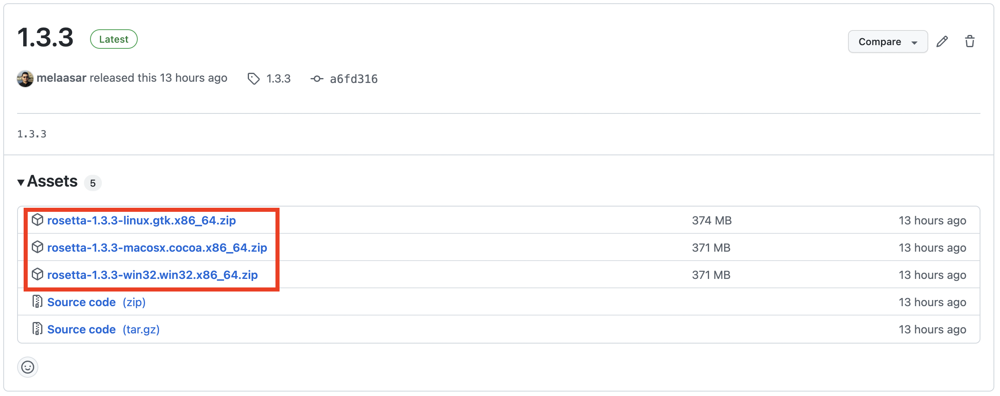
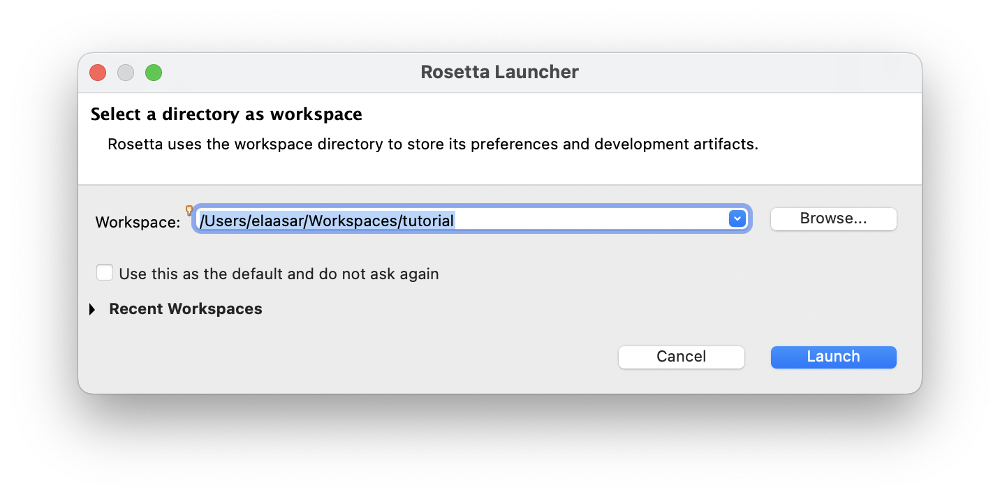

## Abstract

This tutorial will present the ontological approach to systems modeling and analysis using the Ontological Modeling Language (OML), developed by the Jet Propulsion Laboratory (JPL), and contributed through the openCAESAR project. We will first give an brief overview of OML, its history, its architecture, and its tool ecosystem. Then, we hold a number of short hands-on labs where we give attendees some experience with working with OML and its tools involving developing a semantic vocabulary, using it to describe a system, and analyzing the system description for consistency using a logical reasoner, a set of queries, and a UI viewpoint. Familiarity with using the Eclipse IDE would greatly help. Some background in system modeling with languages like UML or SysML, and some knowledge about semantic web also would help but is not essential. It would be great to follow the installation instructions on the tutorial website () before attending.

## Venue

A tutorial session will be given on 10/22/2022 at 5pm at [MODELS 2022](https://conf.researchr.org/track/models-2022/models-2022-tutorials)

## Install Rosetta Workbench

### Option 1: Install Locally

1. Download the latest version of the Rosetta zip file that matches your OS from the [Releases](https://github.com/opencaesar/oml-rosetta/releases/latest) page of the oml-rosetta github repo.

   

1. Unzip the file to a local folder to get the Rosetta app.
    
   * On Mac OS, run the following command in a Terminal after:

     ```
      $ xttr -cr <path/to/Rosetta.app>
     ```
### Option 2: Install from a Docker Image

TBD: Alternatively, download the Rosetta App Docker image from this link.

## Run Rosetta Workbench

1. Navigate to the Rosetta app icon and double click it to open.

    

1. When prompted to choose a workspace, create a new one in your local file system.

    

## OML Tutorials
TBD