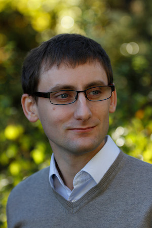

## Topic

This panel will pose questions about what the community could collaborate on the context of Onto MBSE and how to accomplish that.

## Moderator

{: style="float: left;margin-right: 1em;"}

<h2>David Wagner</h2> supervises the Systems Modeling Methodology group at NASA’s Jet Propulsion Laboratory (JPL) at the California Institute of Technology (Caltech). He is also the technical manager for the CAESAR development project that is central to JPL’s Integrated Model-Centric Engineering program. The CAESAR project specifically aims to develop model-centric methodology and tooling to transform the system engineering of JPL missions into a rigorous, agile, and information-centric practice. Prior to working on CAESAR, he served as a model architect and project system engineer on the Europa Clipper project. And prior to that he has extensive experience architecting and developing flight- and ground-based software systems supporting robotic space missions at JPL.

## Panelists

> The panel members are still subject to change

{: style="float: left;margin-right: 1em;"}

<h2>Steven Jenkins</h2> is a Research Fellow in the Acquisition Innovation Research Center at Stevens Institute of Technology. He retired in 2021 after a 32-year career at the Jet Propulsion Laboratory, California Institute of Technology, culminating as Principal Engineer in the Systems Engineering Division. He served in various roles at JPL, including systems engineering for the Space Flight Operations Center, Deep Space Network, and Computer-Aided Engineering. He served as Chief Engineer and Project Manager for Enterprise Information System, a multi-year task to modernize the laboratory’s information technology infrastructure. He served on the systems engineering teams for Project Prometheus and NASA’s Project Constellation. From 2009 he was Chief Engineer for Integrated Model-Centric Engineering, a laboratory-funded initiative to improve systems engineering practice through rigorous application of precise language, mathematical abstractions, and automation. Dr. Jenkins holds a Ph.D. in Electrical Engineering (control systems) from University of California, Los Angeles. He was awarded the Ralph and Marjorie Crump Prize for Excellence in Medical Engineering at UCLA in 1987, a NASA Outstanding Leadership Medal in 1999, a JPL Mariner Award in 2011, a JPL Explorer Award in 2012, and a NASA Systems Engineering Excellence Award in 2013.

{: style="float: left;margin-right: 1em;"}

<h2>Elisa Kendall</h2> is a Partner in Thematix Partners LLC and graduate-level lecturer in computer science, focused on data management, data governance, knowledge representation, and decisioning systems. Her consulting practice includes business and information architecture, knowledge representation strategies, and ontology design, development, and training for clients in financial services, government, manufacturing, media, pharmaceutical, and retail domains. Recent projects have focused on use of ontologies to drive natural language processing, machine learning, interoperability, and other knowledge graph-based applications. Elisa represents knowledge representation, ontology, information architecture, and data management concerns on the Object Management Group (OMG)’s Architecture Board, and is co-editor of the Ontology Definition Metamodel (ODM), Commons Ontology Library (COMMONS), APIs for Knowledge Platforms (API4KP), Multiple Vocabulary Facility (MVF), and Languages, Countries, and Codes (LCC) standards. Ms. Kendall is currently lead ontologist for the EDM Council and a number of leading pharmaceutical companies. She is also on the technical oversight board for and participates in the NIST-sponsored Industrial Ontology Foundry activity developing standardized ontologies for manufacturing. Ms. Kendall also team-teaches Ontology Engineering at Rensselaer Polytechnic Institute biannually. She holds a B.S. in Mathematics and Computer Science from UCLA, and an A.M in Linguistics from Stanford University.

{: style="float: left;margin-right: 1em;"}

<h2>Florian Noyrit</h2> received his PhD for his thesis on heterogeneous modeling languages from Paris Saclay University in 2012. He then joined CEA LIST as a researcher to pursue his research on model-based approaches and to contribute to Papyrus, an open source MBSE tool based on UML and SysML. Through several industrial and academic collaborations, he contributed to the development, adoption and use of model-based technologies in the industry with an emphasis on the design and use of domain specific modeling languages, collaborative modeling and integration of models using ontology technologies. Dr. Florian Noyrit teaches model-based approaches in some Master’s programs in French universities and institutes of technologies.

{: style="float: left;margin-right: 1em;"}

<h2>Kane Ishibashi</h2>