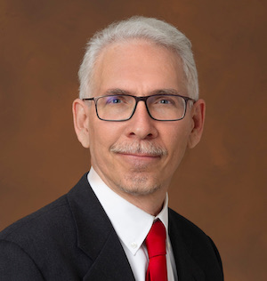

## Topic

This panel will pose questions about what the community could collaborate on the context of Onto MBSE and how to accomplish that.

## Moderator

{: style="float: left;margin-right: 1em;"}

<h2>David Wagner</h2> supervises the Systems Modeling Methodology group at NASA’s Jet Propulsion Laboratory (JPL) at the California Institute of Technology (Caltech). He is also the technical manager for the CAESAR development project that is central to JPL’s Integrated Model-Centric Engineering program. The CAESAR project specifically aims to develop model-centric methodology and tooling to transform the system engineering of JPL missions into a rigorous, agile, and information-centric practice. Prior to working on CAESAR, he served as a model architect and project system engineer on the Europa Clipper project. And prior to that he has extensive experience architecting and developing flight- and ground-based software systems supporting robotic space missions at JPL.

## Panelists

> The panel members are still subject to change

{: style="float: left;margin-right: 1em;"}

<h2>Steven Jenkins</h2> is a Research Fellow in the Acquisition Innovation Research Center at Stevens Institute of Technology. He retired in 2021 after a 32-year career at the Jet Propulsion Laboratory, California Institute of Technology, culminating as Principal Engineer in the Systems Engineering Division. He served in various roles at JPL, including systems engineering for the Space Flight Operations Center, Deep Space Network, and Computer-Aided Engineering. He served as Chief Engineer and Project Manager for Enterprise Information System, a multi-year task to modernize the laboratory’s information technology infrastructure. He served on the systems engineering teams for Project Prometheus and NASA’s Project Constellation. From 2009 he was Chief Engineer for Integrated Model-Centric Engineering, a laboratory-funded initiative to improve systems engineering practice through rigorous application of precise language, mathematical abstractions, and automation. Dr. Jenkins holds a B.S. in Mathematics from Millsaps College, an M.S. in Applied Mathematics from Southern Methodist University, and a Ph.D. in Electrical Engineering (control systems) from University of California, Los Angeles. He completed a postdoctoral fellowship in the Department of Anesthesiology, UCLA School of Medicine. He was awarded the Ralph and Marjorie Crump Prize for Excellence in Medical Engineering at UCLA in 1987, a NASA Outstanding Leadership Medal in 1999, a JPL Mariner Award in 2011, a JPL Explorer Award in 2012, and a NASA Systems Engineering Excellence Award in 2013.