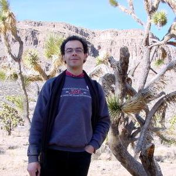

## Abstract

This presentation provides a chronological restrospective about the origins of the Ontological Modeling Language (OML). After a brief tour of the language, the presentation summarizes the four key value propositions of OML: 1) understandability of reasoner explanations, 2) improved authoring via judicious design of abstractions, 3) flexible scoping of closed-world semantics, and 4) scalable reasoning performance.

## Speaker

{: style="float: left;margin-right: 1em;"}

<h2><a href="mailto:nicolas.f.rouquette@jpl.nasa.gov">Nicolas Rouquette</a></h2> is a Principal Computer Scientist at NASA’s Jet Propulsion Laboratory (JPL) at the California Institute of Technology (Caltech). He is responsible for the technical strategy for JPL’s R&D program called Integrated Model Centric Engineering (IMCE) including specifying the Ontological Modeling Language, OML, as a carefully-designed restriction of standards-compliant OWL2-DL augmented with SWRL rules; organizing collaborative model-centric systems engineering as workflows involving man-machine interactions and using GIT, a proven technology for content-addressable storage, for cryptographic assurances of provenance and traceability to occurrences of workflow processes.

## Slides



## Recording

