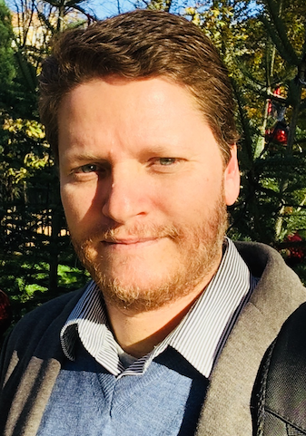

## Abstract
OntoUML is a modeling language grounded on the foundational ontology UFO (Unified Foundational Ontology). UFO is an axiomatic system constituted by ontological micro-theories dealing with, e.g., types and taxonomic structures (including higher-order types), parthood, objectified intrinsic and relational properties, events and processes, etc. OntoUML is a pattern language whose (higher-granularity) primitives are ontology design patterns formed by: (i) ontological distinctions put forth by these micro-theories; (ii) formal constraints that govern how these distinctions be combined to form conceptually clear, semantically transparent and ontologically sound models. In this talk, I will briefly present the language and its foundations. Moreover, I will briefly discuss several engineering tools accompanying the language, including methodological guidelines, as well as computational tools for model construction, formal verification and validation, anti-pattern detection, code generation, and constraint learning.

## Speaker
{: style="float: left;margin-right: 1em;"}

Giancarlo Guizzardi is a Full Professor of Software Science and Evolution as well as Chair and Department Head of Semantics, Cybersecurity & Services (SCS) at the University of Twente, The Netherlands. He is also an Affiliated/Guest Professor at the Department of Computer and Systems Sciences (DSV) at Stockholm University, in Sweden. He has been active for nearly three decades in the areas of Formal and Applied Ontology, Conceptual Modelling, and SoftwareSystems Engineering, working with a multi-disciplinary approach in Computer Science that aggregates results from Philosophy, Cognitive Science, Logics and Linguistics. He is the main contributor to the Unified Foundational Ontology (UFO) and to the OntoUML modeling language. Over the years, he has delivered keynote speeches in more than 80 events in these fields. He is currently an associate editor of a number of international journals including Applied Ontology, and Data & Knowledge Engineering, He is also a member of the Advisory Board of the International Association for Ontology and its Applications (IAOA). Finally, he has conducted many technology transfer projects in areas such as Telecommunications, Risk Management, Tourist, e-Government, Digital Journalism, Complex Media Management, Distributed Software Development, Cybersecurity, Healthcare, and Energy.