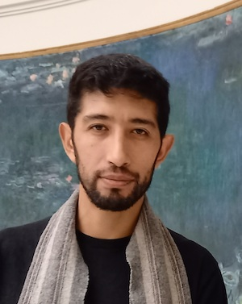

## Abstract
Current MBSE design tools are sophisticated and support expressive meta-languages, yet, these tools have limited capabilities on the detection of semantic errors, the integration of expert knowledge, or the ability to formalize the knowledge from the expert’s design.
 
Our work addresses these limitations by annotating the UML models with domain-specific Ontologies [1]. Enabling this interaction not only makes the ontology’s semantics available to the tooling environment, but the UML model specified by the designer can be translated into Ontology Web Language format (OWL), generating a system specification in terms of the ontology.
 
These “annotated models” are suitable for reasoning tasks, like consistency check and instance checking. We pay particular attention to enforce the annotated model is a consistent extension of the domain-specific ontology.
 
This extended ontology can be re-used and shared to evaluate and constraint further models, or be itself evaluated by semantic-compatible tools.
 
We have formalized the main elements of our approach [2], and we are interested in the extensions of it to other use cases and to SysML V.2.

[1] [Augmenting model-based systems engineering with knowledge](https://dl.acm.org/doi/abs/10.1145/3550356.3561548)

[2] [A Knowledge Management Approach Supporting Model-Based Systems Engineering](https://www.researchgate.net/publication/350063273_A_Knowledge_Management_Approach_Supporting_Model-Based_Systems_Engineering)

## Speaker

{: style="float: left;margin-right: 1em;"}

<h2>Luis Palacios</h2> graduated as a Systems Engineer at the Universidad Católica Boliviana, in La Paz, Bolivia.
Worked in La Paz for 5 years developing online systems and websites. Afterwards, he graduated from the European Master in Computational Logic, based on Dresden (Germany) and Bolzano (Italy). Finally, he obtain a PhD in Computer Science, with focus on Knowledge Representation, at the Université Paris-Saclay/Thales in Palaiseau, France.
Luis is currently working as a research engineer at the CEA at Palaiseau, France.