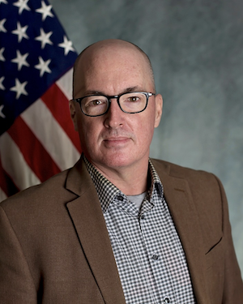

## Abstract

Hierarchical structures provide a means to systematically deconstruct an engineering system of arbitrary complexity into its subsystems, components, and physical processes. Model validation hierarchies can aid in understanding the coupling and interaction of subsystems and components, as well as improve the understanding of how simulation models are used to design and optimize the engineering system of interest. The upper tiers of the hierarchy address systems and subsystems architecture decompositions, while the lower tiers address physical processes that are both coupled and uncoupled. Recent work connects these two general sections of the hierarchy through a transition tier, which blends the focus of system functionality and physics modeling activities. This work also includes a general methodology for how a model validation hierarchy can be constructed for any type of engineering system in any operating environment, e.g., land, air, sea, or space. We review previous work on the construction and use of model validation hierarchies in not only the field of aerospace systems, but also from commercial nuclear power plant systems. Then an example of a detailed model validation hierarchy is constructed and discussed for a surface-to-air missile defense system with an emphasis on the missile subsystems.

## Speaker

{: style="float: left;margin-right: 1em;"}

<h2><a href="mailto:rick.graves.1@us.af.mil">Rick Graves</a></h2> is the Air Vehicles Digital Engineering Lead within the Air Vehicles Division at the Aerospace Systems Directorate (RQ), AFRL, Wright-Patterson AFB, Ohio. Dr. Graves supports the RQ Digital Engineering Lead from the air vehicles perspective as a digital transformation and model-based systems engineering subject matter expert. Dr. Graves is a co-lead for AIAA’s Digital Engineering Integration Committee focused on Digital Ecosystem design & implementation and is an AIAA Associate Fellow. He also actively contributes to NATO AVT and MSG digital thread and digital twin research task groups. Dr. Graves began his federal service career in 2017 and is currently the Air Vehicles Division’s Digital Applications Team Lead for a group of civilians and contractors that leverage resources provided by the DoD High-Performance Computing Modernization Program (HPCMP) to demonstrate the viability of AFRL digital concepts, ground testing, and flight testing. Prior to joining AFRL, Dr. Graves supported the Aeronautical Systems Center (ASC/EN) as a Principal Investigator focused on fixed-wing aircraft vulnerability (F-35). He also has expertise in model development to assess chemical and biological decontamination threats to Air Force assets.

## Slides



## Recording



## Interesting Links

-  [A recently released National Academies report on Digital Twin Research Gaps](https://www.nationalacademies.org/our-work/foundational-research-gaps-and-future-directions-for-digital-twins)