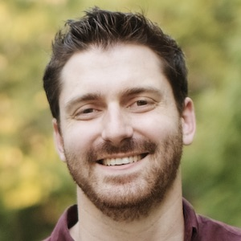

## Abstract

The Digital Engineering Framework for Integration and Interoperability (DEFII) provides a framework for using ontology-aligned data in a Digital Engineering context. This presentation will outline the framework, including the different approaches for interacting with ontology-aligned data. It will also briefly discuss how this approach to knowledge representation can yield insight in multi-domain engineering design and analysis, including approaches to model verification and digital thread representation.

## Speaker

{: style="float: left;margin-right: 1em;"}

Daniel Dunbar is a PhD Candidate in Systems Engineering at Stevens Institute of Technology. His research interests include Digital Engineering and formal knowledge representation as a means to enable better multidisciplinary collaboration. He currently works as a Research Assistant for the Systems Engineering Research Center (SERC) under Dr. Mark Blackburn’s leadership. Before joining Stevens, he worked in the telecommunications domain designing and implementing two-way radio systems.