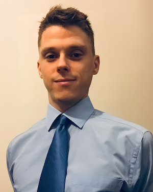

## Abstract

Engineering education has the potential to benefit significantly from the deployment of a digital thread. Integrating data across multiple engineering domains would enable students to see a complete end-to-end engineering process, observe the consequences of their decisions downstream, gain experience working collaboratively in a digital environment, and evaluate each other’s work more effectively. The Digital Engineering Factory (DEF) is a browser-based collaborative engineering environment under development by the authors to support systems and software engineering students at the University of Arizona. The DEF enables the integration of data from domains spanning multiple engineering authoring environments. At its core, the DEF utilizes the modular University of Arizona Ontology Stack (UAOS) to structure project data and enable the use of semantic web technologies. The UAOS is built on the Ontological Modeling Language (OML) and leverages the capabilities of OML Rosetta to support reasoning, model validation and querying. In this presentation, we provide our vision for the DEF, the development approach we have adopted, and our preliminary results and lessons learned. A review of the engineering education literature has provided the foundations for the development of the DEF. Initial assessment of the tools and domain languages used across the engineering authoring environments at the University of Arizona has provided an indication of the domain ontologies required, and a preliminary DEF architecture has been developed.

## Speaker

{: style="float: left;margin-right: 1em;"}

<h2>Joe Gregory</h2> is a postdoctoral research associate at the University of Arizona. His research interests include digital engineering, model-based systems engineering, and the application of semantic web technologies to support engineering. In 2022, he received his PhD in Aerospace Engineering from the University of Bristol for his development of the SysML-based ‘Spacecraft Early Analysis Model’. He is the co-chair of the Digital Engineering Information Exchange (DEIX) Taxonomy Working Group.