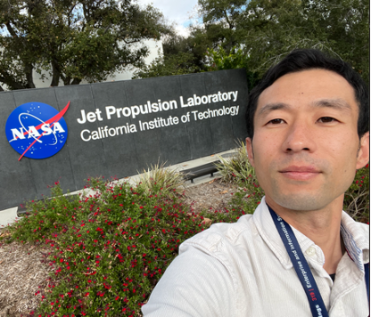

## Abstract

In this presentation, we introduce how openCAESAR, a framework for model-based systems engineering, was applied to the Engineering Test Satellite-9(ETS-9) project at JAXA. We present a use case of the project engineering dashboard to answer the business question related to project management during the system integration phase of the ETS-9 project. We use OML as precise language to describe system architecture. CI/CD technologies enable process automation to deploy dashboard that presents the most highly-digested information derived from analysis. We also present lessons learned through the application of openCAESAR framework focusing on the role of methodologist.

## Speaker

{: style="float: left;margin-right: 1em;"}

<h2>Yuta Nakajima</h2> is a Flight Project Systems Engineer of Engineering Test Satellite 9 project at JAXA. His expertise lies in the development of cutting-edge electric propulsion systems, specifically the 6kW Hall thruster system designed for 5-ton class satellites. In this role, he is responsible for the development of the 6kW power processing unit and integration test of hall thruster, flow controller and power processing unit. He also served as a MBSE practitioner applying MBSE to explore and solve business questions in actual flight project.
He joined the Japan Aerospace Exploration Agency (JAXA) in 2009 as GNC engineer in the Small Demonstration Satellite-4(SDS-4) project. After successful launch and operations of SDS-4, he served as a system engineer at Systems Technology Unit to conduct Pre-Phase A and Phase A study of JAXA’s future missions.
Currently, he is a Visiting Researcher in the Systems Modeling Methodology group at NASA’s Jet Propulsion Laboratory. His research interests include the application of Model-Based Systems Engineering (MBSE) to enhance the architecting process, mission concept exploration, systematic trade-off studies, behavior modeling and integration of descriptive and simulation models.