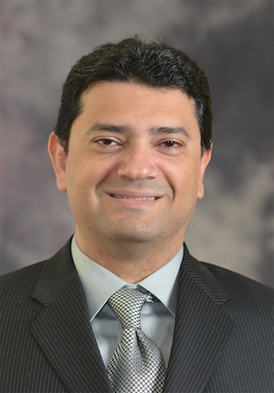

## Abstract

This talk will discuss the need to create an open source software ecosystem to provide tools for Ontological Modeling and Analysis in the context of MBSE. It will also discuss the challenges this ecosystem should aim to tackle, what has already been done, and what remains to be done.

## Speaker

{: style="float: left;margin-right: 1em;"}

<h2>Maged Elaasar</h2> is a Senior Technology Researcher at NASA’s Jet Propulsion Laboratory (JPL)) at the California Institute of Technology (Caltech). He technically leads the Integrated Model Centric Engineering (IMCE) program, which develops the openCAESAR project, which is a technology to transform systems engineering into a rigorous, agile, and data-centric practice. openCAESAR is being used by several space missions at JPL. Maged also leads Autonomica, an R&D project that uses  openCAESAR to support architecting, implementing, and testing autonomous systems. Prior to that, Maged was a technical leader at IBM where he led the R&D of various software and systems modeling technologies. Maged is also the founder of Modelware Solutions, which is a firm that provides consulting and training services in the area of MBSE. Maged is also a lecturer in the Department of Computer Science at the University of California, Los Angeles (UCLA). He is also a lecturer in the Multidisciplinary Graduate Engineering Program at Northeastern University (NEU). He is also a research partner to numerous research labs around the world. His research interests span model-based systems engineering, model-driven software engineering, semantic web, analytics, cloud computing, and autonomy.