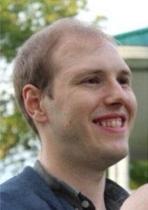

## Abstract

As the engineering of Digital Twins (DTs) involves the domain knowledge of experts, an exciting research direction is to capture and reason about this knowledge using ontologies. This talk will discuss ongoing work applying ontological modeling and the openCAESAR framework to the engineering of DTs and their services. The first topic is enhancing the reporting of DTs in the DevOps cycle by automatically producing textual and graphical reports from an ontologically-based DT. The second topic is on explicitly modelling the processes/workflows for the engineering of DTs in ontologies. This allows for tool-assisted user guidance throughout the DT engineering activity.

## Speaker

{: style="float: left;margin-right: 1em;"}

<h2><a href="mailto:bentley.oakes@polymtl.ca">Bentley Oakes</a></h2> is an Assistant Professor in the Department of Computer Engineering and Software Engineering at Polytechnique Montréal. Previously, he was a post-doctoral researcher at the University of Montréal and at the University of Antwerp. He received his PhD at McGill University in 2019 on the topic of model transformation verification. His research interests include digital twins, verification of cyber-physical systems, model-driven engineering, knowledge representation, and model transformations. Specifically, he is interested in how to capture and utilize domain knowledge for the construction of digital twins. He has published papers in premier model-driven engineering and software engineering venues, including TOSEM, SoSyM, and MODELS. He has been recognized for his exceptional reviewing contributions, regularly serving as a reviewer for conferences and journals and earning multiple awards for best reviewer.

## Slides



## Recording

