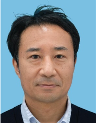
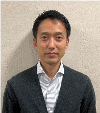
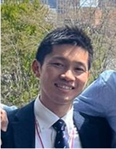

## Abstract

Mitsubishi Heavy Industries (MHI) is a versatile conglomerate with operations spanning multiple industries including aerospace, defense, energy and environment plants, logistics, and more. In our effort to enhance the systems engineering capabilities across our organization, we are currently developing a business process that integrates MBSE. We will be presenting our strategy for implementing MBSE throughout the company and sharing examples from the commercial aviation and rocket sectors. These examples will highlight the ontological modeling of system requirements and architectures, as well as the seamless integration between MBSE and analysis.

## Speakers

{: style="float: left;margin-right: 1em;"}

<h2><a href="mailto:hiroyuki.morino.e5@mhi.com">Hiroyuki Morino</a></h2> is a Lead Systems Engineer at Mitsubishi Heavy Industries (MHI), leading the company-wide promotion of Systems Engineering (SE) and Model-Based Systems Engineering（MBSE）as the INCOSE CAB representative of MHI. He has previously served as a project manager for the aircraft integration team in the Mitsubishi SpaceJet program. Currently, he is taking the initiative to deploy SE and MBSE across the various business domains of MHI including aircraft, defense, space and energy plants.

{: style="float: left;margin-right: 1em;"}

<h2><a href="mailto:yuki.utsumi.z8@mhi.com">Yuki Utsumi</a></h2> is a Systems Engineer at Mitsubishi Heavy Industries' (MHI) Commercial Aviation Systems division. He has previously served as an aircraft integrator for the Mitsubishi SpaceJet program. Currently, his main objective is to develop the future development process for commercial aircraft using MBSE.

 
 

{: style="float: left;margin-right: 1em;"}

<h2><a href="mailto:takeshi.kai.sf@ds.mhi.com">Takeshi Kai</a></h2> is a Lead Systems Engineer at Mitsubishi Heavy Industries' (MHI) Space Systems division, leading the development of a Japanese next-generation rocket and lunar base architecture. He has previously served as a Lead Electrical Systems engineer for H3 rocket’s booster engine development. Currently, he is taking the initiative to accelerate the organizational implementation of MBSE in MHI’s Space Systems division.

## Slides



## Recording

