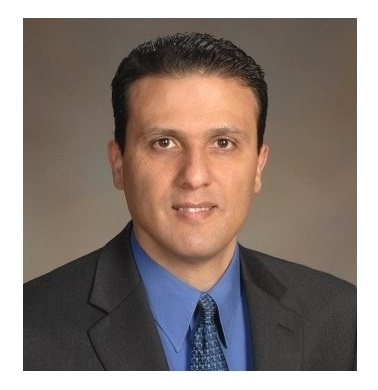

## Abstract

Model-Based Systems Engineering (MBSE) improves systems engineering by using models as the primary means for domain modeling, information exchange, and improving collaboration across disciplines. While MBSE offers numerous benefits, little is known on how it is supported in different organizations, which limits the ability to fully capitalize on the potential of MBSE across industries. To bridge this gap, in this presentation, we report on a survey study that we conducted with over 70 practitioners from various industries including the space industry, defense, automotive, and aviation to assess the current state of MBSE practice. The suvey was conducted in the context of the first edition of the onto:Nexus forum. It included a comprehensive questionnaire designed to explore adoption levels, method adaptation to different organizational structures, tool adaptation, and collaboration challenges. In addition, the study examined how MBSE models are managed, including aspects such as visibility, progress reviews, change management, and modular model organization. We share our findings and propose strategies to enhance the MBSE practice in industry, highlighting the importance of an MBSE ecosystem that integrates agility, rigor, and intelligence.

## Speaker

{: style="float: left;margin-right: 1em;"}

<h2><a href="mailto:wahab.hamou-lhadj@concordia.ca">Wahab Hamou-Lhadj</a></h2> is a Professor and the Chair of the Department of Electrical and Computer Engineering at Concordia University in Montreal, Canada, and an Advisory Board Member of the Concordia Applied AI Institute. He is also an Affiliate Researcher at NASA JPL, Caltech, in Pasadena, USA. His research spans software engineering, AI for software systems, AIOps, software observability, and model-driven engineering. Dr. Hamou-Lhadj has served as the principal investigator for several collaborative projects with various organizations. Many of the tools developed in his lab, such as TotalADS and CommitAssistant, have been successfully transferred to industry and are now used by thousands of developers. His collaborative research with Ubisoft has been featured in prominent media outlets including The Globe and Mail, The Financial Post, Penticton Herald, Wired, and BNN Bloomberg. Dr. Hamou-Lhadj has served on the organizing and program committees of leading conferences such as ICSE, SANER, ICPC, ICSME, ICEIS, and MODELS. He is currently an Associate Editor for IEEE Transactions on Reliability and IEEE Software. Dr. Hamou-Lhadj earned his PhD from the University of Ottawa, Canada, and is a Senior Member of IEEE and a long-standing member of ACM. 