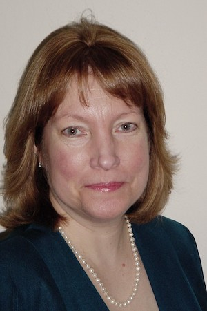

## Abstract

## Speaker

{: style="float: left;margin-right: 1em;"}

<h2><a href="mailto:ekendall@thematix.com">Elisa Kendall</a></h2> is a Partner in Thematix Partners LLC and graduate-level lecturer in computer science, focused on data management, data governance, knowledge representation, and decisioning systems. Her consulting practice includes business and information architecture, knowledge representation strategies, and ontology design, development, and training for clients in financial services, government, manufacturing, media, pharmaceutical, and retail domains. Recent projects have focused on use of ontologies to drive natural language processing, machine learning, interoperability, and other knowledge graph-based applications. Elisa represents knowledge representation, ontology, information architecture, and data management concerns on the Object Management Group (OMG)’s Architecture Board, and is co-editor of the Ontology Definition Metamodel (ODM), Commons Ontology Library (COMMONS), APIs for Knowledge Platforms (API4KP), Multiple Vocabulary Facility (MVF), and Languages, Countries, and Codes (LCC) standards. Ms. Kendall is currently lead ontologist for the EDM Council and a number of leading pharmaceutical companies. She is also on the technical oversight board for and participates in the NIST-sponsored Industrial Ontology Foundry activity developing standardized ontologies for manufacturing. Ms. Kendall also team-teaches Ontology Engineering at Rensselaer Polytechnic Institute biannually. She holds a B.S. in Mathematics and Computer Science from UCLA, and an A.M in Linguistics from Stanford University.