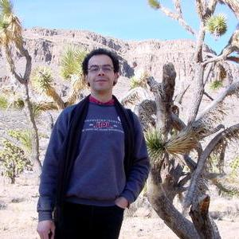

## Abstract

Defining a Concept of Operations (ConOps) for a highly autonomous rover pushes the limits of traditional systems engineering. Unlike deterministic, command-driven systems, a rover with onboard autonomy distributes decision-making across ground operators, a system-level executive, and domain-specific planners (e.g., navigation and communications). This fluid authority complicates several ConOps cornerstones:
- Dual role of autonomy. Onboard autonomy functions are simultaneously actors—initiating and delegating goals—and activities—executing tasks on the system’s behalf. Capturing both perspectives demands new representational formalisms.
- Emergent behavior and nondeterminism. Real-time autonomy adapts to evolving environments, producing behavior traces that cannot be exhaustively scripted; a ConOps must, therefore, encode intent and constraints rather than fixed procedures.
- Temporal authority hand-offs. Mission timelines shift among ground-initiated, ground interventions, and fully autonomous modes. Explicitly documenting these transitions is essential for safety, verification, and operator trust.
- Multi-layer interaction. System-level autonomy allocates resources while specialized planners manage domain-specific activities such as mobility and communication. Clear information contracts, priority rules, and conflict-resolution mechanisms must bind these layers.

This presentation explores a logic-based ConOps framework that treats onboard autonomy as a context-sensitive actor/activity hybrid. Through representative mission scenarios, we map interaction patterns among ground operators and onboard components, making delegation of authority, activity constraints, and contingency management explicit. The framework enables stakeholders to reason about capabilities and requirements and supports scenario-based verification of next-generation autonomous missions.

## Speaker

{: style="float: left;margin-right: 1em;"}

<h2><a href="mailto:nicolas.f.rouquette@jpl.nasa.gov">Nicolas Rouquette</a></h2> is a Principal Computer Scientist at NASA’s Jet Propulsion Laboratory (JPL) at the California Institute of Technology (Caltech). He is responsible for the technical strategy for JPL’s R&D program called Integrated Model Centric Engineering (IMCE) including specifying the Ontological Modeling Language, OML, as a carefully-designed restriction of standards-compliant OWL2-DL augmented with SWRL rules; organizing collaborative model-centric systems engineering as workflows involving man-machine interactions and using GIT, a proven technology for content-addressable storage, for cryptographic assurances of provenance and traceability to occurrences of workflow processes.