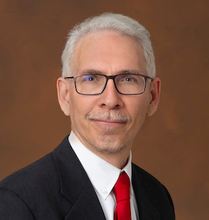

## Abstract

Spacecraft consist of electro-mechanical assemblies which are electrically connected by harness. Designing and delivering harness is a critical-path activity in most projects because the design of the harness depends on the designs of everything they connect, but the harness is needed early in the assembly and test process. This talk describes the multi-step process and associated tooling being developed at JPL focusing on how modeling the appropriate vocabulary at each step was key to making the pipeline work.

## Speaker

{: style="float: left;margin-right: 1em;"}

<h2><a href="mailto:david.a.wagner@jpl.nasa.gov">David Wagner</a></h2> supervises the Systems Modeling Methodology group at NASA’s Jet Propulsion Laboratory (JPL) at the California Institute of Technology (Caltech). He is also the technical manager for the CAESAR development project that is central to JPL’s Integrated Model-Centric Engineering program. The CAESAR project specifically aims to develop model-centric methodology and tooling to transform the system engineering of JPL missions into a rigorous, agile, and information-centric practice. Prior to working on CAESAR, he served as a model architect and project system engineer on the Europa Clipper project. And prior to that he has extensive experience architecting and developing flight- and ground-based software systems supporting robotic space missions at JPL.

## Presentation


