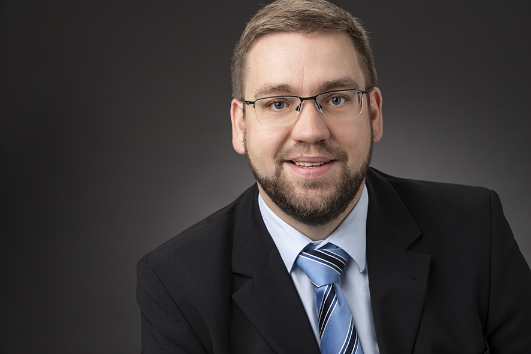

## Abstract

The growing complexity of modern aircraft systems demands advanced modeling approaches to ensure safety, reliability, and efficiency from the early development phase onward. Model-Based Systems Engineering (MBSE) has become a key enabler in addressing these challenges. The SysML v2 modeling language offers enhanced expressiveness and consistency in system architecture modeling. Simultaneously, the Ontology Modeling Language (OML) provides a semantic foundation that can improve interoperability and traceability across models. This presentation explores the synergy between SysML v2 and OML, using an application-oriented example of a control surface actuation system. The presentation will present the first results of this investigation, demonstrating practical modeling approaches while highlighting the advantages and challenges of integrating SysML v2 and OML.
The aim is to develop an initial understanding of how the interaction between these two modeling languages can drive advancements in system design and digital engineering for aircraft systems.

## Speaker

{: style="float: left;margin-right: 1em;"}

<h2><a href="mailto:Oliver.Bertram@dlr.de">Oliver Bertram</a></h2>