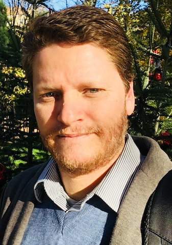

## Abstract

In this talk, I will give an overview of a number of research results produced by the Semantics, Cybersecurity & Services (SCS)
group of the University of Twente, the Netherlands. First, I will show how a Core Ontology of Value and Risk (COVeR) 
has been used to support modeling and reasoning on risk propagation, as well as the elicitation of ethicality requirements for autonomous systems. 
Secondly, I will briefly demonstrate how a second Core Ontology of Security Engineering (extending COVeR) has been used to analyze the MITRE
D3FEND knowledge graph and systematically point to directions for its improvement. Finally, I will discuss a project in 
automating the extraction of high-level attack steps (known as Tactics, Techniques and Procedures - TTPs) from
Cyber Threat Intelligence reports and how further research on understanding inherent ambiguities in TTP knowledge structures 
is key to take a leap in the field.

## Speaker

{: style="float: left;margin-right: 1em;"}

<h2><a href="mailto:g.guizzardi@utwente.nl">Giancarlo Guizzardi</a></h2> is a Full Professor of Software Science and Evolution as well as Chair and Department Head of Semantics, Cybersecurity & Services (SCS) at the University of Twente, The Netherlands. He is also an Affiliated/Guest Professor at the Department of Computer and Systems Sciences (DSV) at Stockholm University, in Sweden. He has been active for nearly three decades in the areas of Formal and Applied Ontology, Conceptual Modelling, and SoftwareSystems Engineering, working with a multi-disciplinary approach in Computer Science that aggregates results from Philosophy, Cognitive Science, Logics and Linguistics. He is the main contributor to the Unified Foundational Ontology (UFO) and to the OntoUML modeling language. Over the years, he has delivered keynote speeches in more than 80 events in these fields. He is currently an associate editor of a number of international journals including Applied Ontology, and Data & Knowledge Engineering, He is also a member of the Advisory Board of the International Association for Ontology and its Applications (IAOA). Finally, he has conducted many technology transfer projects in areas such as Telecommunications, Risk Management, Tourist, e-Government, Digital Journalism, Complex Media Management, Distributed Software Development, Cybersecurity, Healthcare, and Energy.