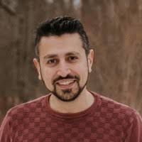

## Abstract

In Model-Based Systems Engineering (MBSE), generating clear and accurate reports is essential for communicating system designs, maintaining traceability, and supporting decision-making across multidisciplinary teams. However, this process often requires familiarity with formal query languages and technical expertise, making it less accessible to non-expert stakeholders.
In this talk, I will present our ongoing work on Mo-Lab—an interactive model reporting and analysis system developed for the openCAESAR platform. Mo-Lab integrates Natural Language Processing (NLP) and SPARQL to enable intuitive, natural language access to MBSE model data.

I will highlight key challenges we’ve encountered, including the scarcity of domain-specific training data and the need to lower technical barriers in querying and reporting. I will also outline our approach to addressing these challenges, with the aim of enabling more intelligent, accessible, and interactive MBSE reporting workflows.

## Speaker

{: style="float: left;margin-right: 1em;"}

<h2><a href="mailto:mhamdaqa@polymtl.ca">Mohammad Hamdaqa</a></h2> is an Associate Professor at Polytechnique Montréal, where he leads the Software and Emerging Technologies (SæT) Lab in the Department of Computer and Software Engineering. His research focuses on the intersection of model abstraction, automation, and analysis to develop secure, intelligent, and sustainable software systems. He explores how machine learning can be integrated with both static and dynamic analysis techniques to automate complex development tasks, enhance software quality, and lower the entry barrier for non-expert users. His work also involves empirical studies on developer experience, aiming to shift software development toward intention-driven models that align more closely with human intention, while addressing critical concerns around security, performance, and safety. Hamdaqa is a co-founder of the Center of Financial Technology at Reykjavik University, which promotes interdisciplinary research in financial technologies. He is actively involved in several research communities, including the Multidisciplinary Institute for Cybersecurity and Cyber Resilience (IMC2), the Software Engineering for Machine Learning Applications (SEMLA) Group, and the Icelandic Blockchain Foundation. A dedicated contributor to the software engineering community, he served as General Chair for SANER 2025 and currently serves on its Steering Committee. He is also a member of the IEEE Computer Society and the Association for Computing Machinery (ACM).