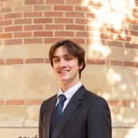

## Abstract

This presentation presents the status of the [OML Code](/projects/2025-02-01-OML-Code) project, which builds upon the foundational work done by the previous [OML Alexandria](/projects/2023-1-20-OML-Alexandria) project. The Ontological Modeling Language (OML) is essential for systems modeling and analysis, and the OML Code project aims to further enhance its accessibility, usability, and functionality.

The project focuses on developing a Visual Studio Code (VS Code) extension for OML, implementing a language server that initially supports both a text editor and a diagram viewer. This is achieved using web-native frameworks such as [Langium](https://langium.org/) and [Sprotty](https://sprotty.org/). The extension is designed to operate seamlessly in the VS Code desktop client as well as in cloud-based platforms like [GitHub Codespaces](https://github.com/features/codespaces), [VSCode.dev](https://vscode.dev/), and [Gitpod](https://www.gitpod.io/).

Attendees will gain insights into the project's objectives, the newly introduced features, and the broader implications these advancements have for ontological modeling and analysis using OML. Future work on supporting live collaborative edits and leveraging AI will be highlighted. 

## Speaker

{: style="float: left;margin-right: 1em;"} 

<h2><a href="mailto:leroylightning@g.ucla.edu">Leroy Gage</a></h2> is a graduating senior in the department of Computer Science at the University of California, Los Angeles (UCLA).