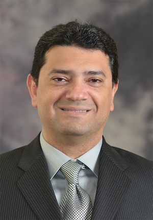

## Abstract

This talk will introduce [ontoNexus Workshop 2024](/events/onto-Nexus-Workshop-2024), its goals, its agenda and its logitics. It will also introduce the theme of the workshop, which is Infusing Rigor and Agility in MBSE. Finally, it will summarize the results of the pre-workshop questionnaire that were submitted by the onto:Nexus community.

## Speaker

{: style="float: left;margin-right: 1em;"}

<h2><a href="mailto:elaasar@jpl.nasa.gov">Maged Elaasar</a></h2> is a Senior Technology Researcher at NASA’s Jet Propulsion Laboratory (JPL)) at the California Institute of Technology (Caltech). He technically leads the Integrated Model Centric Engineering (IMCE) program, which develops the openCAESAR project, which is a technology to transform systems engineering into a rigorous, agile, and data-centric practice. openCAESAR is being used by several space missions at JPL. Maged also leads Autonomica, an R&D project that uses  openCAESAR to support architecting, implementing, and testing autonomous systems. Prior to that, Maged was a technical leader at IBM where he led the R&D of various software and systems modeling technologies. Maged is also the founder of Modelware Solutions, which is a firm that provides consulting and training services in the area of MBSE. Maged is also a lecturer in the Department of Computer Science at the University of California, Los Angeles (UCLA). He is also a lecturer in the Multidisciplinary Graduate Engineering Program at Northeastern University (NEU). He is also a research partner to numerous research labs around the world. His research interests span model-based systems engineering, model-driven software engineering, semantic web, analytics, cloud computing, and autonomy.

## Slides



## Recording


